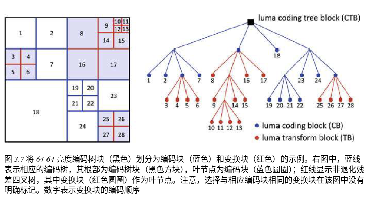
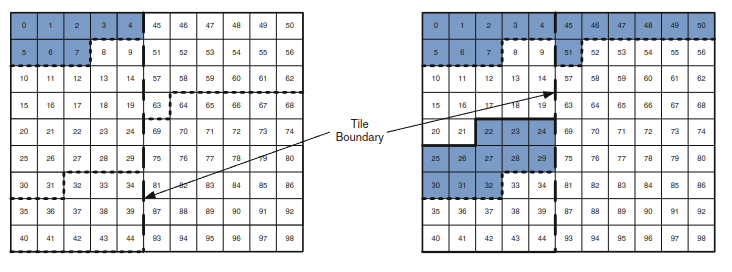

[toc]

# HEVC 高级语法

## NAL 单元标头和 HEVC 比特流

### NAL 单元头

### VCL NAL 单元类型

#### IRAP 图片

NOTE: page -> 18

**1. IRAP 图片定义和类型：**

- **定义：** Intra Random Access Point 图片，即帧内随机访问点图片。
- **NAL 单元类型：** 16-23，包括：
  - IDR (Instantaneous Decoding Refresh) 图片
  - CRA (Clean Random Access) 图片
  - BLA (Broken Link Access) 图片
  - 类型 22 和 23 (目前保留供将来使用)
- **特点：**
  - 必须属于时间子层 0。
  - 仅使用帧内编码技术 (intra coding)，不参考其他图片。

**2. IRAP 图片的作用：**

- **解码起始点：** 提供比特流中可以开始解码的点，即使丢弃 IRAP 图片之前的所有图片，也能从 IRAP 图片开始解码并输出后续图片。
- **调入比特流：** 允许在观看电视或切换频道时从 IRAP 图片开始播放。
- **时间位置搜索：** 支持在视频内容中进行时间位置搜索，例如快进、快退。
- **比特流切换/拼接：** 实现压缩域中不同视频流之间的无缝切换。

**3. IRAP 图片的应用场景：**

- **存储和回放/广播应用：** IRAP 图片通常均匀分布，提供相似频率的随机访问点。
- **实时通信应用：**
  - 随机访问功能不太重要。
  - 发送 IRAP 图片会增加通信延迟。
  - 因此，IRAP 图片可能很少发送，或者仅在需要刷新场景时发送 (例如，视频数据损坏)。

#### 前导和尾随图片

**引导图片和尾随图片相对于 IRAP 图片的位置和依赖关系，它们在解码顺序上的特定顺序，尾随图片只能依赖于关联的 IRAP 图片或同一 IRAP 图片的其他尾随图片。**

**1. 引导图片和尾随图片的定义及与 IRAP 图片的关系 (如图 2.4)：**

*   **引导图片 (Leading Pictures)：**
    *   解码顺序在特定 IRAP 图片之后。
    *   输出顺序在该特定 IRAP 图片之前。
    *   与解码顺序中最接近的先前 IRAP 图片相关联。
*   **尾随图片 (Trailing Pictures)：**
    *   解码顺序和输出顺序都在特定 IRAP 图片之后。
    *   与解码顺序中最接近的先前 IRAP 图片相关联。
    *   必须使用 NAL 单元类型 0–5 之一。

**2. 引导图片和尾随图片的解码顺序和依赖关系：**

*   **解码顺序：** 对于一个关联的 IRAP 图片，解码顺序始终为：
    1. IRAP 图片
    2. 关联的引导图片 (如果有)
    3. 关联的尾随图片 (如果有)
*   **依赖关系：**
    *   特定 IRAP 图片的尾随图片不允许依赖于：
        *   任何引导图片
        *   先前 IRAP 图片的任何尾随图片
    *   特定 IRAP 图片的尾随图片只能依赖于：
        *   关联的 IRAP 图片
        *   同一 IRAP 图片的其他尾随图片

**3. 尾随图片的三种类型：**

*   **时间子层访问 (TSA) 图片 (Temporal Sub-layer Access)**
*   **逐步时间子层访问 (STSA) 图片 (Stepwise Temporal Sub-layer Access)**
*   **普通尾随图片 (TRAIL) 图片**

#### 时间子层访问 (TSA) 图片

**TSA 图片就像一个路标，告诉解码器和网络节点可以从这里开始解码/转发更多的时间子层，以提高视频质量，或者保持现状以节省带宽。**

**1. TSA 图片的定义和限制：**

*   **定义：**  一种特殊的尾随图片，用于指示时间子层的切换点。
*   **限制：**  只有满足以下条件的图片才能使用 TSA 图片类型：
    *   用于预测 TSA 图片或与 TSA 图片相同或更高时间子层中任何后续（按解码顺序）图片的图片，其时间 ID 必须小于或等于 TSA 图片本身的时间 ID。
    *   换句话说，TSA 图片及其后续图片不能依赖于时间 ID 更大的图片。
*   **图 2.5 示例：**  图 2.5 中的图片 P 可以是 TSA 图片，因为只有时间子层 0 中的先前图片被用于预测 TSA 图片本身以及后续图片。

**2. TSA 图片在解码器中的应用：**

*   **时间子层切换：**  当解码器解码比特流中的时间子层的子集，并遇到正好在其正在解码的最大时间子层之上的时间子层的 TSA 图片时，解码器可以选择性地解码更多时间子层。
*   **图 2.5 示例：**  一个仅解码时间子层 0 的解码器，遇到时间子层 1 的 TSA 图片时，可以选择：
    *   (1) 继续仅解码时间子层 0。
    *   (2) 开始解码时间子层 0 和 1。
    *   (3) 开始解码所有三个时间子层 (0, 1, 2)。

**3. TSA 图片在网络节点中的应用：**

*   **网络转发优化：**  网络节点可以利用 TSA 图片来进行选择性的转发，例如在网络拥塞时降低传输的数据量。
*   **低计算开销：**  网络节点只需检查 NAL 单元标头中的 NAL 单元类型和时间 ID 即可识别 TSA 图片，计算开销很小。
*   **无解码风险：**  遇到时间子层 1 的 TSA 图片时，网络节点可以开始转发按解码顺序在 TSA 图片之后的任何时间子层图片，而不用担心解码器无法正确解码，因为 TSA 图片的限制保证了其后续图片不会依赖于更高时间子层的图片。

#### 逐步时间子层访问 (STSA) 图片

**1. STSA 图片的定义和限制：**

*   **定义：** 类似于 TSA 图片，也是一种特殊的尾随图片，用于标记时间子层切换点。
*   **限制：**  STSA 图片本身以及按照解码顺序跟随在其后面的与 STSA 图片具有相同时间 ID 的图片，不参考在 STSA 图片之前的具有相同时间 ID 的图片。
*   **与 TSA 图片的区别：** TSA 图片允许切换到任何更高的子层，而 STSA 图片只允许切换到与自身相同的时间 ID 的子层。

**2. STSA 图片的应用场景：**

*   **逐步时间子层切换：** STSA 图片标记了比特流中可以切换到与其具有相同时间 ID 的子层的位置。
*   **图 2.5 示例：**  图片 P 可以是 STSA 图片，因为它本身以及后续的子层 1 图片不参考任何先前的子层 1 图片。但 P 不能是 TSA 图片，因为它依赖于之前的图片 (具体原因未在摘录中明确，可能与图 2.5 中的依赖关系有关，需要结合图片理解)。

**3. TSA 和 STSA 图片的时间 ID 限制：**

*   TSA 和 STSA 图片的时间 ID 必须大于 0。

**4. HEVC 中时间子层预测的限制：**

*   HEVC 禁止从较高时间子层到较低时间子层的预测。
*   这意味着无论图片类型或时间子层如何，总是可以在任何图片处向下切换到较低时间子层。

#### 普通尾随（TRAIL）图片

**1. 普通尾随图片 (TRAIL) 的定义和特点：**

*   **枚举类型：**  `TRAIL`
*   **时间子层：**  可以属于任何时间子层。
*   **参考限制：**
    *   可以参考：
        *   关联的 IRAP 图片。
        *   与相同 IRAP 图片相关联的其他尾随图片。
    *   不能参考：
        *   引导图片 (Leading Pictures)。
        *   不是与相同 IRAP 图片相关联的尾随图片。
*   **输出限制：**  在输出解码顺序中的下一个 IRAP 图片后，TRAIL 图片无法输出。

**2. TRAIL 图片与其他尾随图片类型 (TSA, STSA) 的关系：**

*   **兼容性：**
    *   所有 TSA 和 STSA 图片都可以被标记为 TRAIL 图片。
    *   所有 TSA 图片可以被标记为 STSA 图片。
*   **可以理解为：**  TRAIL 图片是最通用的尾随图片类型，TSA 和 STSA 是更具体的尾随图片类型。

**3. 使用建议：**

*   **使用最严格的类型：**  建议尾随图片应使用最严格的类型 (例如，如果一个图片满足 TSA 的条件，就应该标记为 TSA，而不是 STSA 或 TRAIL)。
*   **目的：**  为了指示比特流中所有可能的时间子层切换点，方便解码器和网络节点进行更灵活的操作。

#### 瞬时解码刷新 (IDR) 图片

 IDR 图片是一种强制刷新解码器并开始新 CVS 的帧内图片，它完全隔离了之前和之后的图片。IDR 图片有两种子类型：IDR_W_RADL 和 IDR_N_LP，用于区分是否可能存在引导图片。IDR 图片的 POC 始终为 0，其引导图片的 POC 为负。

**1. IDR (Instantaneous Decoding Refresh)**  图片的定义和特点：

*   **定义：** 一种帧内图片 (intra picture)。
*   **作用：** 完全刷新解码过程并启动新的编码视频序列 (CVS)。
*   **依赖关系限制：** IDR 图片和按解码顺序在其后的任何图片都不能依赖于按解码顺序在其之前的任何图片。

**2. IDR 图片的两种子类型：**

*   **IDR_W_RADL：**
    *   可能具有关联的随机访问可解码引导 (RADL) 图片。
    *   即使没有引导图片，编码器也可以使用此类型 (但不建议)。
*   **IDR_N_LP：**
    *   没有任何引导图片 (No Leading Pictures)。
    *   如果 IDR 图片具有引导图片，则禁止使用此类型。

**3. 两种 IDR 图片子类型的作用：**

*   允许系统层在随机访问时知道 IDR 图片是否是第一个输出的图片。

**4. IDR 图片的 POC 值：**

*   **POC 值始终为 0。**
*   **关联的引导图片 (如果有) 的 POC 值为负。**

#### 干净随机存取 (CRA) 图片

CRA 图片是一种特殊的帧内图片，它不像 IDR 图片那样强制刷新解码器或开始新的 CVS，这允许其引导图片参考之前的图片，从而提高了压缩效率。CRA 图片的随机访问需要解码 CRA 图片本身、其特定的引导图片以及后续的所有图片。

**1. CRA 图片的定义和特点：**

*   **定义：** 一种帧内图片 (intra picture)。
*   **与 IDR 图片的区别：**
    *   CRA 图片不刷新解码器，也不开始新的编码视频序列 (CVS - Coded Video Sequence)。
    *   IDR 图片会刷新解码器并开始新的 CVS。
*   **前导图片依赖：** CRA 图片的引导图片可以依赖于按解码顺序位于 CRA 图片之前的图片。

**2. CRA 图片的优势：**

*   **更高的压缩效率：** 允许引导图片依赖于之前的图片通常使得包含 CRA 图片的序列比包含 IDR 图片的序列压缩效率更高，例如大约 6%。

**3. CRA 图片的随机访问：**

*   **步骤：**
    1. 解码 CRA 图片。
    2. 解码 CRA 图片的所有不依赖于按解码顺序位于 CRA 图片之前的任何图片的引导图片 (参见下文 2.2.2.8 节，这段摘录中未提供)。
    3. 解码按解码顺序和输出顺序都跟随在 CRA 图片之后的所有图片。
*   **注意：** CRA 图片不一定具有关联的引导图片。

#### 随机存取可解码前导 (RADL) 和随机存取跳过前导 (RASL) 图片

**1. 引导图片的两种类型：RADL 和 RASL：**

*   **信令：**  必须使用 RADL 或 RASL NAL 单元类型来发送信号。
*   **时间子层：**  可以属于任何时间子层。
*   **参考限制：**  不允许被任何尾随图片引用。

**2. RADL 图片 (Random Access Decodable Leading Pictures)：**

*   **可解码性：**  当在关联的 IRAP 图片处执行随机访问时，保证可解码。
*   **参考限制：**  仅允许参考：
    *   关联的 IRAP 图片。
    *   同一 IRAP 图片的其他 RADL 图片。

**3. RASL 图片 (Random Access Skipped Leading Pictures)：**

*   **可解码性：**  当从关联的 IRAP 图片执行随机访问时，可能无法解码。
*   **图 2.6 示例：**  两个 RASL 图片由于依赖于解码顺序上位于 CRA 图片之前的图片 P 而不可解码。
*   **使用建议：**  尽管不禁止将 RASL 类型用于可解码的引导图片，但建议尽可能使用 RADL 类型。
*   **依赖关系限制：**  仅允许其他 RASL 图片依赖于 RASL 图片。
*   **解码顺序和输出顺序：**
    *   可以按解码顺序混合。
    *   不能按输出顺序混合，RASL 图片必须位于 RADL 图片之前。

**4. RADL 和 RASL 图片与 IRAP 图片的关系：**

*   **IDR_W_RADL 图片：**  所有引导图片必须可解码并使用 RADL 类型。
*   **IDR 图片：**  不允许关联 RASL 图片。
*   **CRA 图片：**  可以具有关联的 RADL 和 RASL 图片 (如图 2.6 所示)。
    *   RASL 图片可以参考相关 IRAP 图片之前的 IRAP 图片，以及按解码顺序该 IRAP 图片之后的其他图片，但不能参考按解码顺序更早的图片 (例如图 2.6 中的 RASL 图片不能参考图片 P)。

**5. 三个消除随机访问时图片不均匀输出的约束：**

*   **基于变量 `PicOutputFlag`：**  指示图片是否要输出。
    *   设置为 0 的情况：
        *   Slice Header中 `pic_output_flag` 标志等于 0。
        *   当前图片是 RASL 图片且关联的 IRAP 图片是 CVS 中的第一个图片。
    *   否则设置为 1。
*   **约束一：**  `PicOutputFlag` 等于 1 且按解码顺序位于 IRAP 图片之前的任何图片必须按输出顺序位于 IRAP 图片之前 (禁止图 2.7a 的情况)。
*   **约束二：**  `PicOutputFlag` 等于 1 且按解码顺序位于 IRAP 图片之前的任何图片必须按输出顺序位于与 IRAP 图片相关联的任何 RADL 图片之前 (禁止图 2.7b 的情况)。
*   **约束三：**  所有 RASL 图片在输出顺序上必须先于任何 RADL 图片。

#### 拼接和断链访问 (BLA) 图片

使用 CRA 图片进行视频拼接具有复杂性，特别是 RASL 图片和 POC 值带来的挑战。为了解决这些问题，HEVC 引入了 BLA 图片，它通过标记拼接点并指示预测链的断裂，简化了拼接过程并避免了解码错误。BLA 图片虽然类似于 IDR 图片，但在 POC 处理和 RASL 图片的支持方面有所不同，使其更适合于拼接场景。

**1. 使用 CRA 图片进行视频流拼接：**

*   **原理：** 将原始比特流的特定 IRAP 访问单元 (通常是 CRA 图片) 及所有后续访问单元替换为来自新比特流的 IRAP 访问单元及后续访问单元。
*   **CRA 图片的优势：**  CRA 图片是压缩效率最高的 IRAP 图片类型，因此在 CRA 图片位置处拼接最为常见。
*   **图 2.8 示例：**  展示了拼接前后的两个比特流，其中虚线框突出了拼接点。

**2. 拼接后 RASL 图片的处理：**

*   **问题：**  CRA 图片后的 RASL 图片可能引用拼接后不存在的图片 (例如图 2.8b 中的图片 P)，导致解码错误。
*   **解决方案一：丢弃 RASL 图片 (如图 2.9a)：**
    *   解码器不会尝试解码这些 RASL 图片。
    *   RADL 图片可以保留或丢弃。
    *   **缺点：** 可能会影响系统层缓冲区，拼接器可能需要修改低级系统参数。
*   **解决方案二：保留 RASL 图片 (依赖于 BLA 图片)：**
    *   系统层缓冲区不受影响。

**3. 拼接后 POC 值的处理：**

*   **问题：**  CRA 图片不开始新的 CVS，拼接点后的 POC 值需要指示正确的输出顺序关系。
*   **解决方案：**  可能需要修改生成的 CVS 中拼接点之后的所有 POC 值。

**4. BLA 图片的引入：**

*   **目的：**  指示拼接的发生，并表明 POC 时间线以及 RASL 图片可能依赖的先前图片的预测被破坏。
*   **作用：**  通知解码器是否应该解码关联的 RASL 图片 (如果存在)。
*   **操作：**  拼接时，CRA 图片需重新标记为 BLA 图片 (如图 2.9b)。
*   **解码器行为：**
    *   遇到 BLA 图片，解码器将丢弃与其关联的任何 RASL 图片。
    *   遇到 CRA 图片，解码器将解码与其关联的 RASL 图片。
    *   所有 RADL 图片都需要解码。

**5. BLA 图片与 IDR 图片的比较：**

*   **相似之处：**  BLA 图片启动新的 CVS 并重置 POC 关系计算。
*   **不同之处：**
    *   **POC 值：** BLA 图片的 POC 值不是 0，而是设置为等于 BLA 图片的Slice Header中用信号通知的 POC 值 (这是必要的，因为转换前的 CRA 图片的 POC 值可能不为 0)。
    *   **RASL 图片：** IDR 图片不允许关联 RASL 图片，而 BLA 图片可以。
    *   **Slice Header语法：**  IDR 图片片段头部的语法与 CRA 和 BLA 图片不同 (例如，CRA 和 BLA 图片发送 POC 信息，而 IDR 图片不发送)。

**6. BLA 图片的类型：**

*   **BLA_N_LP：**  禁止前导图片。
*   **BLA_W_RADL：**  禁止 RASL 图片，但可能存在 RADL 图片。
*   **BLA_W_LP：**  允许 RASL 和 RADL 图片。
    *   建议拼接器检查后续引导图像类型并在拼接输出比特流中使用正确的 BLA 类型。
    *   允许拼接器始终使用 BLA_W_LP，无需检查后面的 NAL 单元。

#### 子层参考和子层非参考图片

**1. 前导图片和尾随图片的类型值：**

*   **偶数编号：**  指示子层非参考图片。
*   **奇数编号：**  指示子层参考图片。

**2. 子层非参考图片：**

*   **定义：**  不被同一时间子层中的任何图片用作预测的参考的图片。
*   **注意：**  仍然可以用作用于预测较高时间子层中的图片的参考图片。

**3. 网络节点中的应用：**

*   **信息利用：**  网络节点可以利用该信息来丢弃其所操作的最高子层的各个子层非参考图片。
*   **目的：**  在不影响解码能力的情况下，选择性地丢弃一些图片，以降低带宽需求或处理负荷。

**4. 图 2.10 示例：**

*   **星号 (*) 指示：**  可以使用子层非参考图片 NAL 单元类型的图片。
*   **条件丢弃：**
    *   `HighestTid` 为 2：可以单独丢弃图片 B5, B6, B7。
    *   `HighestTid` 为 1：可以类似地丢弃图片 B3。
    *   `HighestTid` 为 0：可以类似地丢弃图片 P2。
*   **影响：**  不会影响对直到该子层的时间子层中的其他图片进行解码的能力。

#### 保留和未指定的 VCL NAL 单元类型

除了上面描述的VCL NAL单元类型之外，表2.1还包含几种保留的VCL NAL单元类型，它们分为IRAP和nonIRAP类别。这些保留值不允许在符合版本 1 规范的比特流中使用，并且旨在用于将来的扩展。符合 HEVC 版本 1 的解码器必须丢弃具有指示保留值的 NAL 单元类型的 NAL 单元。某些 NAL 单元类型也被定义为“未指定”，这意味着系统可以使用它们来携带不影响指定解码过程的指示或数据。

### 编码视频序列和比特流一致性（CVS）

**1. 编码视频序列 (CVS - Coded Video Sequence)：**

*   **定义：**  一系列访问单元，满足以下条件之一：
    *   以 IDR 或 BLA 访问单元开始，并包括直到但不包括下一个 IDR 或 BLA 访问单元或直到比特流末尾的所有访问单元。
    *   如果 CRA 是比特流中的第一个访问单元，或者解码器设置为通过外部方式将 CRA 图像视为 BLA 图像，则从 CRA 访问单元开始。

**2. 比特流 (Bitstream)：**

*   **定义：**  一系列一个或多个编码视频序列。
*   **两种形式：**
    *   **NAL 单元流 (NAL unit stream)：**  按解码顺序排列的 NAL 单元序列。
        *   需要系统环境提供额外的成帧信息来识别每个 NAL 单元的位置和大小。
    *   **字节流 (Byte stream)：**  NAL 单元流中插入了称为“起始码”的特殊固定值字符串。
        *   可以通过扫描起始码字符串值来识别 NAL 单元的边界。

**3. HEVC 规范的合规性要求：**

*   **必须满足所有要求和限制：**  例如，IRAP NAL 单元的时间 ID 必须等于 0。
*   **不合格数据的处理：**
    *   解码器可以简单地拒绝不符合 HEVC 规范的数据。
    *   标准没有规定解码器遇到此类数据时应该做什么。
    *   解码器可能会或可能不会尝试继续解码。
*   **编码器输出：**  HEVC 编码器的输出应始终完全符合 HEVC 规范。

**4. 保留值 (Reserved Values)：**

*   **定义：**  规范中保留的语法元素值，未用于特定版本的 HEVC 规范，但可能会在未来的 HEVC 版本中指定和使用。
*   **编码器：**  不允许使用语法元素的保留值。
*   **解码器：**
    *   必须忽略保留的语法元素值。
    *   如果在 NAL 单元标头中找到保留值，则必须丢弃整个 NAL 单元。
    *   **目的：**  使得传统解码器能够正确解码任何未来比特流的基础层，即使其中包含针对早期版本标准制作的解码器未知的附加扩展层。

**5. 未指定值 (Unspecified Values)：**

*   **定义：**  某些语法元素值未指定，就它们对标准解码过程的影响而言，解码器也必须忽略这些值。
*   **与保留值的区别：**  保留值可以在 HEVC 的未来版本中使用，而未指定值保证将来永远不会被指定，并且可以用于标准中未定义的其他目的。
*   **主要目的：**  允许外部规范使用它们。
*   **示例：**  未指定的 NAL 单元类型值 48，建议在 HEVC RTP 有效负载规范中用于信号通知包含多个 NAL 单元的聚合数据包。
    *   在 RTP 有效负载规范中，值 48 用作转义码，指示数据不应按原样传递到 HEVC 解码器，而是需要额外的 RTP 标头数据来识别 NAL 单元的位置和大小。

### 非 VCL NAL 单元类型

**1. 访问单元定界符 (Access Unit Delimiter) NAL 单元：**

*   **作用：**  可选地用于指示访问单元之间的边界。
*   **位置：**  如果存在，必须是访问单元中的第一个 NAL 单元。
*   **时间 ID：**  必须与关联的编码图片具有相同的时间 ID。
*   **有效负载：**  只有一个码字，指示访问单元中可能出现哪些片类型。

**2. 序列结束 (End of Sequence) 和比特流结束 (End of Bitstream) NAL 单元：**

*   **作用：**  分别用于指示编码视频序列 (CVS) 的结束和比特流的结束。
*   **位置：**  如果使用，将被放置在其访问单元的最后。
*   **时间 ID：**  必须指示时间层 0。
*   **有效负载：**  没有有效负载，仅包含两个字节的 NAL 单元标头。

**3. 填充数据 (Filler Data) NAL 单元：**

*   **作用：**  对解码过程没有影响，可用于在缺乏足够数量的 VCL 数据的情况下将数据通道填充到所需的比特率。
*   **有效负载：**  一系列等于 “11111111” 的字节，后跟一个等于 “10000000” 的字节。
*   **时间 ID：**  必须与编码图片具有相同的时间 ID。
*   **位置限制：**  不允许位于访问单元中的第一个 VCL NAL 单元之前。

NAL 单元类型 41-47 被保留，类型 48-63 未指定。

## 参数集

### 视频参数集 (VPS)

### 序列参数集 (SPS)

### 图像参数集 (PPS)

### Slice Segments Header

### 系统层集成方面

## 图片缓冲管理

### 图片顺序计数和 DPB

### 参考图片集

### 参考图片集信令

#### Slice Header和 SPS 中的 RPS 信令

### 参考图片列表

## 视频可用性信息 (VUI) 和补充增强信息 (SEI)

## 假设参考解码器 (HRD)

# HEVC 中的块结构和并行性特征

## 用于预测和变换编码的块分区

**1. 基于块的混合视频编码方法：**

*   **普遍性：**  自 H.261 以来，所有 ITU-T 和 ISO/IEC 视频编码标准都采用。
*   **核心思想：**  将图片分割成块，并对每个块进行预测和变换编码 (如图 3.1 所示)。
*   **关键区别：**  不同标准的关键区别在于它们为样本块提供了不同的编码模式集。
    *   **编码模式决定：**
        *   使用帧内预测还是帧间预测。
        *   如何将块细分为子块以进行预测和/或变换编码。
    *   **预测参数：**  块通常与预测参数 (例如运动矢量或帧内预测模式) 相关联。

**2. 视频编码标准的范围：**

*   **规定：**  比特流语法和解码过程的结果。
*   **不规定：**  编码过程 (留给编码器实现者自由发挥)。
*   **编码效率：**  很大程度上取决于编码算法，包括编码模式、预测参数、量化参数和变换系数的选择。

**3. 基于拉格朗日比特分配的编码算法：**

*   **核心思想：**  通过最小化可用选择集上的失真$D$ 和相关比特数 $R$ 的加权和来确定编码参数。公式：

$$
p^*=\arg\min_{\forall p\in\mathscr{A}}D(p)+\lambda\cdot R(p).
$$

*   **拉格朗日参数 (λ)：**  一个常数，确定失真和比特数之间的权衡，从而确定重建视频的质量和比特流的比特率。

**4. 影响编码效率的因素：**

*   **多个方面：**  子样本插值的插值滤波器、熵编码的效率、环路滤波技术等。
*   **主要改进来源：**  通过增加对图片或样本块进行编码的支持可能性来提高编码效率，例如：
    *   更高的运动矢量精度。
    *   更灵活的图片编码顺序选择。
    *   更大的可用参考图片集。
    *   更多的帧内预测模式。
    *   更多的运动矢量预测器。
    *   更多的变换大小支持。
    *   更多的块大小支持。

**5. 块划分的重要性：**

*   **不同的划分与不同的率失真权衡相关：**
    *   将块细分为多个子块通常会降低预测误差能量，但会增加传输预测参数所需的比特率。
    *   细分是否有利取决于实际的样本块。
*   **扩展支持的划分模式集：**
    *   通常会增加信号通知所选模式所需的比特率。
    *   但会减少对预测残差进行编码所产生的平均率失真成本。
    *   如果一组分区模式 A 产生较小的期望拉格朗日率失真成本$E$如下，则可以提高编码效率。

$$
\operatorname{E}\left\{\min_{\forall p\in\mathscr{A}}D(p)+\lambda\cdot R(p)\right\}
$$

*   **编码器复杂度：**  更大的划分模式集合通常需要更高的编码器计算复杂度来评估所有模式。
*   **设计权衡：**  需要在潜在编码效率和所需编码器复杂度之间进行权衡。

**6. HEVC 中基于四叉树的分层块分区：**

*   **背景：**  计算能力的提高和高清/超高清视频编码的需求。
*   **目标：**  支持更大的块大小 (处理高分辨率)，同时支持小块大小 (适应图片的局部属性)。
*   **解决方案：**  引入基于四叉树语法的分层块分区概念。
*   **优势：**
    *   简单、统一、高效。
    *   允许应用快速最优树修剪算法来确定最佳块划分。

### 编码树块(CTB)和编码树单元

传统视频编码标准中宏块的概念及其在高分辨率视频编码中的局限性。为了解决这些问题，HEVC 引入了 CTU 作为基本处理单元，它支持更大的块大小，并提供了更灵活的图片划分机制。CTU 大小的选择需要在编码效率、延迟、内存需求和计算复杂度之间进行权衡。

**1. 传统视频编码标准中的宏块：**

*   **定义：**  将视频序列的每个图片划分为宏块。
*   **大小：**  16x16 个亮度样本块以及两个关联的 8x8 个色度样本块 (4:2:0 色度采样格式)。
*   **作用：**  基本处理单元，编码器必须为每个宏块选择编码模式。
*   **编码模式：**  确定所有样本使用帧内预测还是运动补偿预测，以及是否将宏块划分为子块。
*   **限制：**  16x16 的宏块大小限制了可用于信号发送预测参数 (如运动数据) 的最大块大小。

**2. 宏块在高分辨率视频编码中的局限性：**

*   **主要设计：**  主要针对 QCIF 到标准清晰度视频分辨率。
*   **高清和超高清视频的普及：**  推动了对更高分辨率视频编码的需求。
*   **效率低下：**  将最大块大小限制为 16x16 亮度样本对于高分辨率视频在率失真意义上是低效的。
    *   许多图像区域可以用相同的运动参数描述，但比 16x16 块大得多。
    *   需要为每个 16x16 宏块发送编码模式，消耗大量比特率。
    *   由于高分辨率视频中相邻样本之间的空间相关性增加，使用更大的变换大小对残差信号进行编码更有利。

**3. HEVC 中的编码树单元 (CTU)：**

*   **目标：**  为所有视频编码应用提供比 H.264 更高的编码效率，特别是针对高分辨率视频。
*   **定义：**  每个图片被划分为方形编码树块 (CTB)，亮度 CTB 覆盖 `2^N x 2^N` 个亮度样本，每个色度 CTB 覆盖 `2^(N-1) x 2^(N-1)` 个色度样本 (4:2:0 格式)。CTU 包含一个亮度 CTB、两个对应的色度 CTB 以及相关语法。
*   **作用：**  HEVC 中的基本处理单元，类似于宏块。
*   **CTU 大小：**
    *   参数 N 在序列参数集中传输。
    *   编码器可以选择 N 为 4、5 或 6，对应于 16x16、32x32 和 64x64 的亮度 CTB 大小。
    *   较大的 CTU 大小通常提供更好的编码效率，但也可能增加编码器/解码器延迟、内存需求以及编码器计算复杂度。
*   **灵活的划分机制：**  HEVC 包含一种灵活的机制，用于将图片划分为可变大小的基本处理单元。

**4. 图 3.2 的说明：**

*   **对比：**  将 1280x720 图片划分为 16x16 宏块和 64x64 CTU 的对比。
*   **结论：**  16x16 宏块仅覆盖图片的非常小的区域，而 64x64 CTU 提供了更合适的描述，因为它可以更好地覆盖可以用相同运动参数描述的区域。

图 3.2 将具有 1280x720 亮度样本的图片划分为宏块和编码树单元的图示： 

(a) 将图片划分为 16x16 个宏块，如 ITU-T 和 ISO 的所有现有视频编码标准中所见/IEC； 

(b) 将图像划分为 64x64个编码树单元，HEVC Main profile中支持的最大编码树单元大小

### 编码树、编码块(CB)和编码单元

**1. 现有标准中的宏块：**

*   **作用：**  既用于图片划分，也表示编码器为其选择编码模式的处理单元。
*   **编码模式选择：**  对于每个宏块，决定使用帧内编码还是帧间编码 (运动补偿预测)。
*   **子块划分：**  可以细分为更小的块以进行预测和预测参数的信号发送。

**2. H.264/MPEG-4 AVC High Profile 中的宏块编码模式：**

*   **帧内编码模式：**
    *   `Intra-4x4`：亮度分量细分为 4x4 块，基于已编码的相邻块的样本进行预测，使用 4x4 变换对预测残差进行编码。
    *   `Intra-8x8`：对 8x8 块进行帧内预测和变换编码。
    *   `Intra-16x16`：预测整个 16x16 亮度块，使用两级变换对预测残差进行编码。
    *   色度：预测整个 8x8 色度块，使用 8x8 变换的两级变体对残差进行编码。
*   **帧间编码模式：**
    *   `Inter-16x16`：使用同一组运动参数完成所有亮度和色度样本的运动补偿预测。
    *   `Inter-16x8` 和 `Inter-8x16`：分别在水平和垂直方向上分割成两个相同大小的矩形，每个矩形关联一个单独的运动参数集。
    *   `Inter-8x8`：分割为 4 个 8x8 子宏块，每个子宏块可以编码为单个 8x8 块或进一步分成 8x4、4x8 或 4x4 块。
    *   变换编码：支持基于 4x4 和 8x8 块的变换编码，变换大小在宏块级别上用信号表示。在 `Inter-8x8` 模式下，如果至少一个子宏块被进一步细分，则推断使用 4x4 变换。
    *   色度残差信号始终使用 4x4 变换进行编码。

**3. 将宏块语法直接应用于 HEVC CTU 的问题：**

*   **大块帧内预测和运动补偿预测之间选择的效率低下：**  在 P 和 B Slice中，通常可以使用运动补偿预测来很好地预测大多数样本，仅对少量样本使用帧内编码更有利。
*   **复杂的语法：**  为了允许像 H.264 中那样的精细块结构，宏块和子宏块模式的概念必须在额外的层次结构级别上扩展，产生复杂的语法。
*   **变换大小的限制：**  如果变换大小不能在编码树块内改变，则编码器不能很好地适应视频图片中的局部统计。

**4. HEVC 中的编码单元 (CU)：**

*   **定义：**  CTU 可以分为多个可变大小的 CU。
*   **组成：**  一个亮度 CB、两个相应的色度 CB (对于非单色视频格式) 以及与这些样本块关联的语法。
*   **四叉树语法 (编码树)：**  每个 CTU 包含一个四叉树语法，指定其细分为 CU (如图 3.4 所示)。

*   **`split_cu_flag`：**  在 CTU 级别，指示完整的 CTU 是否形成 CU 或者是否被分割成四个相等大小的块。如果 CTU 被分割，则对于每个结果块，传输另一个 `split_cu_flag`，指定该块是否代表 CU 或者是否被进一步分割。
*   **最小 CU 大小：**  在序列参数集中用信号表示，范围可以从 8x8 亮度样本到 CTU 的大小。
*   **编码顺序：**  CTU 内的 CU 按深度优先顺序 (z 扫描) 编码 (如图 3.4 所示)。
*   **边界处理：**  如果视频图片的水平或垂直尺寸不代表 CTU 尺寸的整数倍，则推断边界处的 CTU 被分割，直到边界处生成的块与图片边界重合。

**5. CU 的作用和优势：**

*   **作用：**  表示分配了编码模式的处理单元，类似于旧标准中的宏块，但具有可变的大小。
*   **优势：**
    *   **优雅且统一的语法：**  编码树结构为将 CTU 划分为用于帧内预测、运动补偿预测和变换编码的块提供了优雅且统一的语法。
    *   **更灵活的块划分：**  允许在更小的单位上在帧内和帧间编码之间进行决策，提高了编码效率。
    *   **更好的局部统计适应性：**  允许变换大小在编码树块内改变，使编码器更好地适应视频图片中的局部统计。

### 预测块(PB)和预测单元

**1. CU 的预测模式：**

*   **两种选择：**  帧内预测 (intra prediction) 或运动补偿预测 (inter prediction)。
*   **信令：**  在比特流内用信号表示。

**2. 帧内预测：**

*   **亮度 CB：**
    *   **35 种空间帧内预测模式：**  必须选择其中一种并在比特流内用信号通知。
    *   **可选的子块划分：**  如果 CU 具有最小 CU 尺寸，则亮度 CB 可以分解为四个相等尺寸的方形子块，并为每个子块传输单独的帧内预测模式。
*   **色度 CB：**
    *   **单个色度帧内预测模式：**  独立于 CU 大小，为 CU 选择单个色度帧内预测模式并在比特流内用信号通知。
    *   **五个候选项：**  其中之一是为亮度 CB 选择的帧内预测模式 (或第一个亮度帧内块的模式，如果亮度 CB 被细分)。
*   **限制最小 CU 大小的原因：**  避免冗余语法，因为对于大于最小 CU 大小的块，将块划分为 4 个 CU 并为每个 CU 传输亮度帧内预测模式，与将整个块作为一个 CU 并传输四个亮度子块的帧内预测模式，对于亮度分量是等效的。

**3. 变换块 (TB)：**

*   **定义：**  编码块可以被划分为多个变换块，这些变换块表示应用单个二维变换来对预测残差进行编码的单元。
*   **划分方式：**  由第二四叉树结构指定，其中 CU 表示四叉树根。
*   **帧内预测模式的关联：**  如果亮度 CB 被细分为四个子块以用信号通知帧内预测模式，则它也被细分以用于变换编码的目的，使得变换块内的所有样本总是使用相同的帧内预测模式来预测。
*   **帧内预测在变换块基础上完成：**  因为两个图像样本之间的相关性随着样本之间的距离而减小，使用更接近的重构样本可以获得更好的预测信号。
*   **权衡：**
    *   帧内预测的效率随着变换块尺寸的增加而降低 (预测样本与参考样本之间的平均距离增加)。
    *   变换编码的平均编码效率通常随着变换大小的增加而增加。
*   **优点：**  允许在帧内预测和变换编码效率之间选择合适的权衡。也可以被视为降低传输帧内预测模式所需比特率的一种方式。

图 3.5 以 8 8 编码块的水平帧内预测为例，将其划分为 4 4 变换块，结果如图 3.5 所示。应当注意，一方面，帧内预测的效率随着变换块的尺寸的增加而降低，因为预测样本与用于预测的参考样本之间的平均距离增加。

图 3.5 如果基于编码块 (a) 或变换块 (b) 应用帧内预测，则说明具有 4x4 变换块的 8x8 编码块内选定样本的水平帧内预测

**4. 帧间预测和预测块 (PB)：**

*   **定义：**  如果使用帧间预测对 CU 进行编码，则亮度和色度 CB 可以进一步划分为所谓的预测块 (PB)。PB 是使用相同运动参数进行运动补偿预测的亮度或色度分量的样本块。
*   **运动参数：**  包括运动假设的数量 (一个或两个) 以及每个运动假设的参考图片索引和运动矢量。
*   **色度 CB 的划分：**  与亮度 CB 相同。
*   **预测单元 (PU)：**  亮度 PB 和色度 PB 与相关语法一起形成预测单元 (PU)。
*   **运动参数的信令：**  对于每个 PU，在比特流中用信号发送一组运动参数。

**5. CU 到 PU 的划分模式：**

*   **八种模式：**  如图 3.6 所示，包括：
    *   `M x M`：整个 CU 编码为单个 PU。
    *   `M/2 x M/2`：CU 分割成四个相同大小的正方形 PU (仅支持最小 CU 大小)。
    *   `M x M/2`：CU 垂直细分为两个相同尺寸的矩形 PU。
    *   `M/2 x M`：CU 水平细分为两个相同大小的 PU。
    *   四种非对称划分模式 (AMP)：将 CU 细分为两个不同大小的矩形 PU (仅支持大于 8x8 亮度样本的 CU 大小)。

图 3.6 支持将编码单元 (CU) 分割为 1、2 或 4 个预测单元 (PU) 的分割模式。并非所有 CU 大小都支持 .M=2/ .M=2/ 模式和底行中显示的模式

*   **限制：**
    *   为了最小化最坏情况的内存带宽，仅当所选的最小 CU 大小大于 8x8 亮度样本时才支持 `M/2 x M/2` 模式。
    *   8x4 和 4x8 亮度样本的 PU 被限制为使用单一运动假设。

**6. 分区模式的选择和权衡：**

*   **更多模式的潜力：**  支持用于将图片块分割成用于运动补偿预测的子块的更多模式通常提供提高编码效率的潜力。
*   **编码器复杂度：**  只有当编码器评估大量支持的分区模式时，才能利用这种潜力，否则可能降低编码效率。
*   **HEVC 的选择：**  HEVC 支持的分区模式集已被选择为合理的权衡。
*   **禁用非对称分区模式：**  HEVC 提供了通过 SPS 中编码的语法元素禁用非对称分区模式的可能性，以减少低复杂度编码器的计算负担。

**7. 运动补偿块大小的演变：**

*   **趋势：**  从一代标准到下一代标准提高编码效率的一个关键方面是增加运动补偿预测支持的块大小的数量。
*   **对比：**  表 3.1 总结了不同标准支持的运动补偿块大小 (不包括隔行扫描视频的专用工具)：
    *   H.262/MPEG-2 视频：16x16。
    *   H.263 和 MPEG-4 Visual：16x16 和 8x8。
    *   H.264/MPEG-4 AVC：从 4x4 到 16x16 (包括非方形块)。
    *   HEVC：从 4x8 和 8x4 到 64x64。

### 残差四叉树变换、变换块(TB)和变换单元

图 3.7 显示了 64 64 亮度 CTB 的示例，该 CTB 沿着相应的编码树和残差四叉树的嵌套四叉树结构递归地细分为亮度 CB 和亮度 TB。一般来说，色度CB到色度TB的划分是通过相同的残差四叉树来描述的。然而，如下文将描述的，存在一种例外，即同一CU的亮度CB和色度CB的划分不相同。

通过允许不同的变换块大小，残差四叉树变换使得变换基函数能够适应残差信号的变化的空间频率特性：

- 较大的变换块尺寸具有较大的空间支持，可提供更好的频率分辨率。
- 较小的变换块尺寸具有较小的空间支持，可提供更好的空间分辨率。

空间分辨率和频率分辨率两者之间的权衡可以由编码器控制自由选择，例如**基于拉格朗日优化技术**。

#### 残差四叉树(RQT)结构

**1. 残差四叉树 (RQT)：**

*   **定义：**  一种四叉树结构，用于描述如何将 **编码块 (CB)** 细分为 **变换块 (TB)**。
*   **参数：**  每个 RQT 受三个参数限制：
    *   `do`：树的最大深度。
    *   `nmin`：最小允许变换大小 (以变换块宽度的二进制对数表示)。
    *   `nmax`：最大允许变换大小 (以变换块宽度的二进制对数表示)。
*   **取值范围：**  `nmin` 和 `nmax` 可以在 2 到 5 之间变化，对应于 4x4 到 32x32 的 TB 大小。
*   **深度限制：**  RQT 的最大允许深度限制了细分级别的数量。例如，`do = 1` 意味着亮度 CB 可以编码为单个 TB，也可以分割为 4 个 TB，但不允许进一步分割。

**2. RQT 中的隐式细分：**

*   **强制细分：**  如果亮度 CB 大小大于最大变换大小，则亮度 CB 被迫细分以符合对变换大小的限制。例如，如果亮度 CB 大小为 64x64，最大深度 `do = 0`，最大变换大小为 32x32 (`nmax = 5`)，则必须将亮度 CB 分割。
*   **跨 PB 边界的变换：**
    *   当 `do = 0` 且使用运动补偿预测 CU 且相关的预测分区由多个 PU 组成时，亮度 CB 始终分为四个 TB。
    *   当 `do > 0` 且进行帧间预测 CU 时，RQT 细分独立于 PU 划分，这可能导致 TB 覆盖多个 PB。
    *   **权衡：**  跨 PB 边界应用变换可能会降低某些 CB 的编码效率，但也可能提高其他 CB 的编码效率。实验结果表明，允许编码器自由决定是否跨 PB 边界应用变换可以提高平均编码效率。

**3. RQT 与帧内预测的关系：**

*   **帧内预测的关联：**  对于帧内预测 CU，将亮度和色度 CB 分割为 TB 不仅决定了应用于残差编码的变换的大小，还决定了单个帧内预测的块的大小。
*   **最小 CB 大小的特殊情况：**  如果亮度 CB 大小等于最小 CB 大小，则可以用信号发送四种亮度帧内预测模式，每种模式针对四个同等大小的方形子块之一。在这种情况下，TB 不能跨越完整的亮度 CB，因为需要完全重建先前的子块以生成当前子块的预测信号。因此，如果亮度 CB 被细分为四个子块用于传输帧内预测模式，则它也被细分为四个 TB。
*   **进一步细分：**  每个生成的 TB 都可以进一步细分。

**4. RQT 中的叶节点：**

*   **最小变换大小：**  当达到最小变换大小时 (即 `n = nmin`)，在 RQT 中隐含叶节点。
*   **最大 RQT 深度：**  即使最小变换尺寸允许较小的 TB，递归细分也受到最大 RQT 深度的限制 (即 `d = do`)。

**5. RQT 与颜色分量的关系：**

*   **相同的 RQT 结构：**  对于每个 CU 最多传输一个单一变换树语法，因此，相同的 RQT 结构确定所有颜色分量的 TB，从而导致亮度和色度分量的相同细分。
*   **4:2:0 格式的例外：**  对于 4:2:0 色度格式视频信号中的 4x4 亮度 TB，细分将导致 2x2 色度 TB，而 HEVC 不支持 2x2 色度 TB。因此，允许 RQT 分割 8x8 亮度 TB，但不允许分割相应的 4x4 色度 TB。

**6. 变换单元 (TU)：**  表示大于 4x4 样本的亮度 TB 或具有 4x4 样本大小的四个亮度 TB、对应的两个色度 TB 以及关联的语法结构。

#### RQT 参数的信令方式

**1. RQT 参数的信令：**

*   **参数：**  最大 RQT 深度 `do`，最小和最大变换大小的二进制对数 `nmin` 和 `nmax`。
*   **传输位置：**  SPS 级别。
*   **帧内和帧间 CU 的区别：**  可以为帧内和帧间预测 CU 指定和发信号通知不同的 `do` 值。
*   **强制细分的影响：**  当强制细分时 (TB 大小大于最大变换大小)，传输的深度值不一定对应于细分数量。

**2. RQT 结构的信令：**

*   **条件：**  针对每个编码树叶节点 (即每个 CU)，在传输 CU 预测模式、PU 分区和 PU 相关语法之后，如果该 CU 的残差信号由一个或多个非零变换系数级别表示，则需要用信号通知 RQT 结构。
*   **`split_transform_flag`：**  为每个 RQT 节点传送，指示它是叶节点 (0) 还是内部节点 (1)。
*   **冗余情况：**  在某些情况下 (例如强制细分)，`split_transform_flag` 的信令是多余的，可以推断出来。

**3. 编码块标志 (CBF)：**

*   **作用：**  指示特定 TB 或整个 CU 中是否存在显着的 (非零) 变换系数级别。
*   **`rqt_root_cbf`：**
    *   用于运动补偿预测的 CU。
    *   指示是否为整个 CU 传输至少一个非零变换系数级别。
    *   如果 `rqt_root_cbf = 1`，则用信号通知 RQT 结构。
    *   如果 `rqt_root_cbf = 0`，则不发送进一步的残差信息，所有变换系数级别和剩余样本值被推断为 0，不传输 RQT 语法。
    *   对于跳过的 CU (cu_skip_flag = 1)，不传输 `rqt_root_cbf`。
    *   对于帧内预测的 CU，`rqt_root_cbf` 始终被推断为 1。
*   **`cbf_luma`、`cbf_cb` 和 `cbf_cr`：**
    *   在 `rqt_root_cbf = 1` 的情况下，针对每个亮度 TB 和两个相关的色度 TB 发送。
    *   `cbf_luma`：在 RQT 叶节点级别表示亮度 TB 的重要性。
    *   `cbf_cb` 和 `cbf_cr`：与 `split_transform_flag` 符号交织编码，即在内部 RQT 节点处，表示色度分量的重要性。
    *   **作用：**  允许对视频信号中的方形块进行有效的信号发送，其中一个或两个色度残差信号等于 0，但亮度残差信号不等于 0。
    *   **冗余减少：**  在某些条件下，亮度和色度 TB 的 CBF 信令也是冗余的，可以推断出来。

#### 快速编码器控制(快速树剪枝算法，启发式早期剪枝技术)

*   **问题：**  如果把树分的太细，计算量会非常大。
*   **解决方案 1：**  有一种聪明的算法 (广义 BFOS 和快速树剪枝) 可以不用把所有可能性都算一遍，就能找到最好的分法。
*   **解决方案 2：**  还可以用一些小技巧 (启发式早期剪枝) 来进一步减少计算量，比如看到一些明显不好的分法就直接跳过。
*   **效果：**  用了这些方法，可以让编码器算的更快，同时对编码效果的影响很小。

**1. RQT 和编码树划分的计算复杂度：**

*   **指数级增长：**  随着树深度 `d` 的增加，不同 RQT 划分的数量以及不同编码树划分的数量比双指数表达式 `2^(2^d)` 增长得更快。
*   **穷举搜索的不可行性：**  这意味着通过强力穷举搜索每个分区选项及其所有竞争选项来找到率失真意义上的最佳划分是不可行的。

**2. 广义 BFOS 算法和快速树剪枝：**

*   **广义 BFOS 算法 [5]：**  可以实现率失真意义上的最佳划分的推导，而不需要穷举搜索。
*   **快速树剪枝：**  在不应用任何早期终止策略的情况下，快速树剪枝过程的计算复杂度与 `0.4 * (4^(d+1) - 1) / 3` 成正比，它是最大深度 `d` 的四叉树的内部节点数。

**3. 启发式早期剪枝技术：**

*   **目的：**  进一步降低编码器端树生长过程的计算复杂度。
*   **[38] 中提出的算法：**  当所有未量化变换系数的幅度低于适当选择的、与量化器步长相关的阈值时，终止给定 RQT 节点处的进一步细分的评估。
*   **效果：**
    *   编码器运行时间可以减少约 5-15%。
    *   对编码效率的影响很小。
    *   对于较大的最大 RQT 深度，编码器运行时间的减少始终较高。

### 表现

TODO -> page 68

## 用于打包和并行处理的图片分区

**1. HEVC 和 H.264/MPEG-4 AVC 的共同点：**

*   **基于块的混合视频编码范例：**  都遵循相同的编码方法。
*   **两层高层系统设计：**  都包含 VCL 和 NAL。

**2. 视频编码层 (VCL)：**

*   **作用：**  包括所有低级信号处理，例如：
    *   块分割
    *   图像间和图像内预测
    *   变换编码
    *   熵编码
    *   环路滤波

**3. 网络抽象层 (NAL)：**

*   **作用：**  将编码数据和相关信息封装到 NAL 单元中。
*   **NAL 单元：**  一种逻辑数据包格式，有助于通过各种传输层进行视频传输。

**4. 访问单元 (Access Unit)：**

*   **组成：**  HEVC 比特流由多个访问单元组成。
*   **内容：**  每个访问单元都包含与具有不同捕获或呈现时间的图片相关联的编码数据。
*   **划分：**  每个访问单元被分为 NAL 单元，包括：
    *   一个或多个 VCL NAL 单元
    *   零个或多个非 VCL NAL 单元

**5. VCL 和非 VCL NAL 单元：**

*   **VCL NAL 单元：**  包含编码片，表示视频图像样本的分组块。
*   **非 VCL NAL 单元：**  包含相关联的数据，例如：
    *   **参数集 NAL 单元：**  包含解码过程所必需的数据。
    *   **补充增强信息 (SEI) NAL 单元：**  支持补充数据的可选支持。

**6. 参数集：**

*   **类型：**
    *   **序列参数集 (SPS)**
    *   **图片参数集 (PPS)**
    *   **视频参数集 (VPS) (HEVC 新增)：**  用于传达有关在系统层使用的编码视频序列的特性的附加元数据。

**7. NAL 单元结构：**

*   **组成：**  NAL 单元标头和 NAL 单元有效负载。
*   **NAL 单元标头 (双字节)：**
    *   包含有关有效负载类型的信息。
    *   包含时间标识符 (类似于 H.264/MPEG-4 AVC 的 SVC 扩展)，指示时间分层预测结构中的级别。
*   **优点：**  媒体网关 (MANE) 可以方便地访问此信息，以对流进行智能、媒体感知操作，例如使用时间可扩展性的比特流细化，而无需解析 NAL 有效负载数据。
*   **起始码前缀模拟预防：**  必要时，有效负载数据还会与模拟预防字节交织，以确保不会模拟 NAL 有效负载内的字节对齐起始码前缀。

### Slice

**1. HEVC 中Slice的概念和作用：**

*   **定义：**  将图片划分为可以独立解码的单元，同 H.264 中的Slice。
*   **独立性：**  每个Slice可独立于同一图片的其他Slice进行解码 (熵、残差和预测解码)。
*   **组成：**  可以由完整图片及其部分组成。
*   **最小构建块：**  在 HEVC 中，Slice中包含的图片的最小块结构单元是单个编码树单元 (CTU)。
*   **三个目的：**
    *   **错误鲁棒性：**  在数据丢失的情况下能够重新同步解码和解析过程。
    *   **MTU 大小匹配：**  适应 IP 网络中常见的最大传输单元 (MTU) 大小的网络约束。
    *   **并行处理：**  将图像划分为可以并行处理的单元。

**2. Slice处理和独立性：**

*   **处理顺序：**  Slice中的 CTU 按光栅扫描顺序进行处理。
*   **独立解析和解码：**  每个Slice都可以独立解析和解码。
*   **实现方式：**
    *   在每个Slice末尾处终止 CABAC 比特流。
    *   打破图片内跨Slice边界的 CTU 依赖关系 (例如用于图片内预测、上下文选择或概率估计的依赖关系)。
*   **编码效率的影响：**  由于空间冗余的利用减少，编码效率通常随着用于图片的Slice数量的增加而显着降低。

**3. Slice的组成：**

*   **Slice Header：**  提供用于Slice数据解码的特定信息，例如Slice所属图片内的编码 CTU。
*   **Slice数据：**  实际的编码数据。
*   **开销：**  当使用多个Slice时，每个Slice Header的开销会导致编码效率降低，尤其是在较低比特率下。

**4. HEVC 中Slice碎片的新功能：**

*   **背景：**  传统的Slice概念过于僵化，无法满足所有预期需求，特别是多个Slice Header和Slice边界处的图片内依赖性的严格破坏会导致比特率开销。
*   **两个级别的Slice碎片：**
    *   **Slice Segments ：**
        *   每个Slice可以在 CTU 边界处被划分为一个或多个Slice Segments。
        *   **独立Slice Segments ：**  Slice的第一个Slice Segments，包含完整的Slice (片段) 头，通常也称为常规Slice。
        *   **从属Slice Segments ：**  Slice内的所有后续Slice Segments (如果有)，具有大大缩短的Slice Segments头。
        *   **依赖性：**  在同一Slice CTU 内，跨Slice Segments边界的依赖性对于从属Slice Segments是允许的。
    *   **Slice Segment Subset ：**
        *   每个Slice Segment Subset包含相应Slice Segments覆盖的 CTU 子集的所有编码位段数据。
        *   为相应Slice Segments头中的每个 (但第一个) 子集提供入口点偏移，以进行正确的子集识别。
        *   最适合与 HEVC 的新型高级并行化工具一起使用。

#### Slice Segments

**1. Slice Segments的概念：**

*   **提出：**  在 [34] 中首次提出。
*   **定义：**  HEVC 中的Slice被定义为一组Slice Segments，其中Slice的第一片段是独立Slice Segments，后面是零个或多个从属Slice Segments (如图 3.9 所示)。

**2. 从属Slice Segments的特点：**

*   **Slice Header：**  仅包含Slice Header参数的最小集合，由 `dependent_slice_segment_flag` 指示。
*   **图片内依赖性：**  不会破坏该片段所属片段内跨越 CTU 边界的图片内依赖性。
*   **CABAC 处理：**
    *   每个从属Slice Segments数据由其自己的 CABAC 比特流传送。
    *   CABAC 引擎需要在片段边界处刷新和重置。
    *   所有 CABAC 上下文变量的适配内容都存储在每个Slice Segments的末尾 (包括独立Slice Segments)，以便在后续从属Slice Segments中重新用于初始化。
*   **编码效率：**  除了附加的、相当少量的Slice Segments头部比特之外，使用从属Slice Segments不会引入编码效率损失。
*   **`end_of_slice_segment_flag`：**  对于Slice Segments中的每个 CTU，用信号通知该语法元素以指示相应的 CTU 是否是Slice Segments中的最后一个 CTU，如果是，则终止 CABAC 比特流并存储 CABAC 上下文变量。

**3. 从属Slice Segments的作用和应用场景：**

*   **错误鲁棒性：**  不提供与独立Slice Segments相同的错误鲁棒性。
*   **超低延迟应用：**  在无错误的环境中，编码器可以选择将编码图像分割成许多小单元，并在完成对图像的其余部分的编码之前将它们提供给网络传输堆栈，而不会招致损坏的图片依赖性。
*   **并行化：**  Slice Segments可以用作并行化技术的入口点。
*   **MTU 大小匹配：**  提供了一种用于对超大 NAL 单元进行比特流划分的分段机制，以符合 MTU 大小要求，而不会造成大量的编码效率损失。
*   **熵编码数据的正确分段：**  在丢失从属Slice Segments的情况下，独立Slice Segments连同在丢失片段之前的所有其从属Slice Segments可以被正确解码。

**从属Slice Segments通过最小化的Slice Header开销和允许图片内依赖性，实现了低延迟、并行化和高效的 MTU 大小匹配，同时在一定程度上保留了独立Slice Segments的优点。虽然它不提供与独立Slice Segments相同的错误鲁棒性，但在无错误环境中，它可以显著提高编码效率和降低延迟。**

#### Slice Segment Subsets

**1. Slice Segment Subset的引入目的：**

*   出于并行处理目的的图片分区不一定要求每个结果分区都包含在单独的 NAL 单元中。

**2. Slice Segment Subset的定义和划分方式：**

*   **定义：**  将Slice Segments数据 (优选地是独立Slice Segments的数据) 划分为编码 CTU 数据的不相交子集，使得所有子集的并集覆盖整个Slice Segments数据。
*   **划分方式：**  不需要使用额外的标头数据。

**3. Slice Segment Subset的特点：**

*   **字节对齐的 CABAC 比特流：**  每个Slice Segment Subset由单独的字节对齐的 CABAC 比特流组成。
*   **终止：**  通过使用特殊终止语法元素 `end_of_sub_stream_one_bit` 来终止。
*   **入口点偏移：**
    *   对于除第一个子流之外的所有子流，入口点偏移 (以字节为单位) 由相应Slice Segments标头中的语法元素 `entry_point_offset_minus1[i]` 表示。
    *   入口点偏移语法元素的长度 (以位为单位) 由先前发信号通知的 `offset_len_minus1` 语法元素给出。
    *   第一个子集从Slice Segments数据的第一个字节开始，紧接在Slice Segments标头数据之后 (该数据被视为字节 0)。
    *   入口点信令基于字节对齐的子流长度，包括任何可能必要的模拟预防字节。

**4. Slice Segment Subset与高级并行化工具的关系：**

*   **并行解码的限制：**  如果没有任何进一步的外部导出的每个Slice子集中第一个 CTU 的位置信息，并行解码是不可能的。
*   **与高级并行化工具的结合：**  当与 HEVC 中的新高级并行化工具一起使用时，对Slice Segment Subset施加了许多进一步的限制 。

#### Slice Segment Header

**1. HEVC Slice Segments头与 H.264/MPEG-4 AVC Slice Header的关系：**

*   **相似性：**  许多语法元素与 H.264/MPEG-4 AVC 中的相应Slice Header语法类似。
*   **概述：**  本小节通过讨论共性和差异，简要概述了 HEVC 中独立和从属Slice Segments的Slice Segments头中的主要语法元素。

**2. 通用语法元素 (独立和从属Slice Segments都存在)：**

*   **`first_slice_segment_in_pic_flag`：**  指示Slice Segments是否为图片中的第一个Slice Segments。
*   **`slice_segment_address`：**  如果不是图片中的第一个Slice Segments，则确定Slice Segments中按 CTU 光栅扫描顺序的第一个 CTU 的地址 (类似于 H.264 中Slice Header中第一个宏块的地址)。
    *   图片中第一个 (独立) Slice Segments的第一个 CTU 始终是覆盖包含图片左上亮度样本的亮度 CTB 的 CTU。
*   **`slice_pic_parameter_set_id`：**  标识该Slice Segments所属的图片所使用的特定图片参数集 (PPS)。
    *   给定图片的所有Slice必须具有相同的 `slice_pic_parameter_set_id` 值。
    *   引用的 PPS 包含进一步的信息，例如引用的 SPS 和控制Slice Segments头中特定语法元素的存在的信息。
*   **`dependent_slice_segment_flag`：**  如果 PPS 中启用了相应的分段功能，则区分独立Slice Segments (0) 和从属Slice Segments (1)。
    *   对于从属Slice Segments，除了Slice Segment Subset的入口点偏移信令之外，剩余Slice Segments头语法元素的所有值均从前一独立Slice Segments的完整Slice Segments头导出，而不是被明确传送。

**3. 独立Slice Segments头特有的语法元素：**

*   **`slice_type`：**  指示Slice的编码类型 (B、P 或 I Slice)，类似于 H.264。
*   **图片顺序计数 (POC) 信息：**  对于不是 IDR 图片的所有图片，包含允许导出包围图片的 POC 的信息。
*   **参考图片集 (RPS) 管理：**  包含几个新的语法元素 (与 H.264 相比)，用于正确管理 RPS。
*   **解码和解析过程相关的语法元素：**
    *   指示时间运动矢量预测器使用的标志。
    *   Slice QP 增量。
    *   用于加权预测的参数。
    *   指示对 P 和 B Slice使用一组特定的 CABAC 初始化值。
*   **环路滤波相关的语法元素：**
    *   用于启用/禁用当前Slice的去块滤波器的可选标志。
    *   用于启用/禁用整个环路滤波 (包括 SAO) 跨越当前Slice的左边界和上边界的可选标志。

**4. 可扩展性：**

*   **可选语法元素：**  HEVC Slice Segments头语法还包括允许通过标准的更高版本和/或配置文件扩展Slice Segments头的可选语法元素。

### 高级并行化特性

**1. 并行处理的意义和硬件背景：**

*   **意义：**  可以实现视频编解码器在无法以非并行执行方式实时支持编解码器操作的系统上的实时操作。
*   **硬件支持：**  现代硬件架构支持多线程，尤其是多核处理器的普及。
*   **多核革命：**  通用处理器制造商和基于 ARM 的低功耗处理器制造商开始生产多核处理器，因为提高时钟速度变得更加困难/成本更高。
*   **性能增益的实现：**  仅当目标平台以可以使用多个硬件执行单元 (例如，多核处理器) 的方式支持线程的并行执行时，才可以实现多线程的性能增益。

**2. 视频编码标准中的并行化技术：**

*   **图片级并行化：**
    *   **原理：**  同时处理多个图片，前提是满足运动补偿预测的时间依赖性。
    *   **优点：**  实施起来相对简单，不会造成编码效率损失。
    *   **缺点：**
        *   并行化可扩展性受运动矢量长度和/或 GOP 大小的限制。
        *   每个核心的工作负载可能不平衡。
        *   提高了处理帧速率，但没有改善延迟。
*   **Slice级并行化：**
    *   **原理：**  将每个图片划分为Slice，Slice彼此独立 (除了有关跨Slice边界环内过滤的潜在依赖性)。
    *   **缺点：**
        *   环路滤波可以跨Slice边界应用，H.264 中可能需要使用单个处理单元执行完整图像的去块操作。
        *   多个Slice显着降低了编码效率。
    *   **建议：**  只有当每张图片的Slice数量受到严格限制时，才建议利用Slice级并行性。
*   **块级并行化：**
    *   **原理：**  使用异构处理核心，例如一个核心专用于熵编码，一个用于环路滤波，一个用于帧内预测等。
    *   **H.264 中的应用：**  宏块级流水线在基于硬件的 H.264 实现中非常广泛。
    *   **波前调度方法 [40]：**  宏块以类似波前的方式分组，以确保有足够数量的宏块可用，同时考虑宏块之间的空间依赖性。
    *   **并行处理不同图片的宏块：**  只要正确处理运动补偿预测造成的时间依赖性，就可以并行处理。
    *   **熵解码的限制：**  熵解码只能在Slice级别并行化，因此必须与宏块或 CTU 重建解耦。
    *   **局限性：**
        *   熵解码和重建的解耦增加了内存使用量。
        *   仅减少了重建阶段的图片解码时间，没有减少熵解码阶段的解码时间。
        *   单线程熵解码步骤可能是整体吞吐量的瓶颈和限制因素。

**4. HEVC 中的高级并行处理工具：**

*   **目的：**  克服 H.264 中采用的并行化策略的限制，提供基于 VCL 的编码工具，这些工具专门设计用于在高级并行架构上进行处理。
*   **两个新工具：**
    *   **波前并行处理 (WPP)：**  一种遵循波前调度原理的并行处理方法，它基于将图像划分为 CTU 行，使得不同分区的 CTU 之间的依赖关系 (无论是在预测编码还是在熵编码方面) 为很大程度上得以保存。
    *   **Tiles：**  类似于Slice的图片分区机制，其基于将图片灵活地细分为 CTU 的矩形区域，从而禁止不同分区的 CTU 之间的编码依赖性。
*   **共同特点：**  都允许将每张图片细分为多个可以并行处理的分区，每个分区包含整数个 CTU。
*   **与Slice Segment Subset的关系：**  当启用 WPP 或 Tiles 时，通常对于每个分区使用单独的Slice Segment Subset，以便相应的入口点偏移 (在Slice Segments标头中) 指示该Slice中所有图片分区子流 (除了第一个子流) 的开始位置。
*   **Main, Main10 和 Main Still Picture 配置文件的限制：**  只能同时使用其中一种工具。

#### Tiles

**1. Tiles 的定义和启用：**

*   **定义：**  当启用 Tiles 时，图片被分为由垂直和/或水平边界分隔的矩形 CTU 组。
*   **启用：**  通过 PPS 语法元素 `tiles_enabled_flag` 指示 Tiles 的使用。
*   **与 H.264 FMO 的相似性：**  与 H.264 中使用Slice组映射类型 2 的 FMO 功能有一些相似之处。

**2. Tiles 的配置：**

*   **灵活性：**  可以为整个序列定义 Tiles 的数量及其边界的位置，也可以根据图片的不同进行更改。
*   **PPS 中的信令：**  通过 PPS 中的参数实现，例如 `num_tile_columns_minus1`、`num_tile_rows_minus1`、`uniform_spacing_flag`、`column_width_minus1` 和 `row_height_minus1`。
*   **基于图片的更改：**  由于 Tiles 信令包含在 PPS 中，因此该结构可以基于每个图片而改变。
*   **优点：**  编码器可以使用不同的方式来排列不同图片中的 Tiles，以便控制用于编码/解码的核之间的负载平衡。
*   **负载平衡示例：**  如果图片的某个区域需要更多的处理资源，则该区域可以被细分为比其他区域更多的 Tiles。
*   **预先应用：**  需要在实际编码过程之前应用所需的编码器/解码器资源管理 (它决定了 Tiles 结构)。

**3. Tiles 的边界和依赖性：**

*   **依赖性破坏：**  类似于Slice边界，Tiles 边界会破坏解析和预测依赖性，以便可以独立处理 Tiles。
*   **环内滤波器：**  环内 (去块和 SAO) 滤波器仍然可以跨越 Tiles 边界，以防止 Tiles 边界伪影。
*   **控制：**  由 PPS 中的 `loop_filter_across_tiles_enabled_flag` 语法元素控制。

**4. Tiles 的优点：**

*   **错误鲁棒性：**  如果图片的 Tiles 在不同的数据包中传输，则 Tiles 可以独立于图片中的其他 Tiles 进行处理，这使得 Tiles 非常适合有损传输环境。
*   **更好的编码效率 (与Slice相比)：**  Tiles 中空间距离的减小导致 Tiles 内样本之间的空间相关性的潜在更高的利用，以及可以减少Slice Header开销 (至少在每个 Tiles 不完全使用一个Slice的情况下是这样)。

**5. Tiles 的扫描顺序：**

*   **更改：**  Tiles 将 CTU 的常规扫描顺序从基于图片的光栅扫描顺序更改为基于 Tiles 的光栅扫描顺序 (如图 3.10 所示)。

图 3.10 基于图块的 CTU 光栅扫描顺序，图中有 9 个不同大小的图块。请注意，图块边界用粗虚线标记

*   **解码器处理：**  解码器可以仍然以基于图片的光栅扫描方式处理 Tiles 的 CTU，而不利用任何并行化 (通过在从一个 CTU 行移动到下一行时在 Tiles 边界处存储和重新加载每个 Tiles 的所有 CABAC 上下文变量的值来实现)。

**6. Slice、Slice Segments和 Tiles 之间的关系约束：**

*   **约束：**  图片中的每个Slice和 Tiles 至少应满足以下条件之一：
    *   一个Slice中的所有 CTU 属于同一 Tiles。
    *   一个 Tiles 中的所有 CTU 属于该 Tiles 同一Slice。
*   **Slice Segments和 Tiles 的约束：**  图片中至少应满足以下条件之一：
    *   Slice Segments中的所有 CTU 属于同一 Tiles。
    *   Tiles 中的所有 CTU 属于同一 Slice Segments。
*   **结果：**  起始点与 Tiles 的起始点不一致的Slice或Slice Segments不能跨越多个 Tiles。
*   **示例：**  图 3.11 给出了将图片相同地划分为两个 Tiles，并采用两种不同的方式分割为Slice和Slice Segments的示例。

图3.11 使用两个瓦片将示例性瓦片分区分段成片和片片段的两种不同方式。左：一个Slice包括四个相关Slice Segments。右图：三个Slice，每个Slice包含一个相关Slice Segments。请注意，图块边界用粗虚线标记，Slice边界用粗实线标记，Slice Segments之间的边界用虚线标记。属于独立Slice Segments的 CTU 为蓝色阴影

**7. Tiles 的并行处理和通信：**

*   **CTU 级：**  对于 CTU 级熵解码和重建，Tiles 不需要处理器之间的通信。
*   **环路滤波：**  如果环路滤波阶段在跨 Tiles 边界滤波模式下运行，则需要通信。
*   **关闭跨 Tiles 边界滤波的缺点：**  可能会导致 Tiles 边界处的视觉伪影。

**8. Tiles 的编码效率 (与Slice比较)：**

*   **优点：**  通常提供更好的编码效率，因为 Tiles 中空间距离的减小和潜在的Slice Header开销减少。
*   **缺点：**  与Slice类似，编码效率损失通常随着 Tiles 数量的增加而增加，这是由于沿 Tiles 边界的依赖关系的破坏以及在每个 Tiles 开始处所有 CABAC 上下文变量的重新初始化。

#### 波前并行处理 (WPP)

**1. 波前并行处理 (WPP) 的概念和启用：**

*   **概念：**  当启用 WPP 时，图片的每个 CTU 行构成一个单独的分区。
*   **启用/禁用：**  由 PPS 语法元素 `entropy_coding_sync_enabled_flag` 控制。
*   **处理方式：**  每个 CTU 行都通过使用两个连续 CTU 的延迟来相对于其前一个 CTU 行进行处理 (如图 3.12 所示)。

图 3.12 沿 CTU 行的波前并行处理以及 CABAC 上下文变量从 CTU1 到 CTU11、从 CTU12 到 CTU22 的传播。 。 。 ，从CTU45到CTU55，等等

**2. WPP 的工作原理和依赖性：**

*   **依赖性保留：**  除了每个 CTU 行末尾的 CABAC 上下文变量之外，连续 CTU 行之间的依赖关系不会在分区边界处被破坏。
*   **CABAC 上下文变量传播：**  为了减轻每个 CTU 行起点处的传统 CABAC 初始化可能导致的潜在编码效率损失，(部分) 调整的 CABAC 上下文变量的内容从前一个 CTU 行的已编码/解码的第二个 CTU 传播到当前 CTU 行的第一个 CTU (如图 3.12 所示)。
*   **编码效率损失：**  与不使用 WPP 但具有相同设置的图片编码的情况相比，WPP 引入的编码效率损失相对较小。
*   **CTU 扫描顺序：**  WPP 不会更改 CTU 的常规光栅扫描顺序。
*   **转码：**  通过使用相对简单的 CABAC 转码技术，可以将 WPP 比特流转码为非 WPP 比特流或从非 WPP 比特流转码，而无需对图像重建过程进行任何更改。

**3. WPP 的并行处理和可扩展性：**

*   **并行处理：**  当启用 WPP 时，图像中 CTU 行数的多个线程可以并行工作来处理各个 CTU 行。
*   **线程数：**  取决于亮度样本中的图像高度与亮度 CTB 尺寸 (宽度或高度) 的比率。
*   **解码线程的调度：**  需要以这样的方式组织线程处理的调度：对于每个 CTU，其右上角的解码由于需要在解码线程之间维护 CTU 依赖性，因此前一个 CTU 行中的相邻 CTU 必须已完成。
*   **波前依赖性：**  导致 CTU 从左上滚动到右下的“波前” (如图 3.12 所示)，并且不允许处理 CTU 行的所有线程同时开始解码。

*   **并行化效率低下 (斜坡效率低下)：**  逐行 CTU 处理线程无法在每行末尾同时完成解码，导致并行化效率低下，随着使用的线程数量的增加，这种效率变得更加明显。
*   **流水线问题：**  由于 CTU 负载平衡效率低下而导致停顿，可能会出现其他流水线问题，例如一个 CTU 行中的慢 CTU 可能会导致后续 CTU 行的处理停顿。

**4. WPP 的开销和优点：**

*   **额外开销：**  WPP 需要在完成每个 CTU 行中的第二个 CTU 的编码/解码后存储所有 CABAC 上下文变量的内容。
*   **优点：**  除此之外，WPP 不需要对分区边界进行任何额外的处理来保留熵编码/解码、图片内预测或环内过滤所利用的依赖性。
*   **报头开销：**  可以保持较小，可以仅包括经由Slice Segment Subset用信号通知分区入口点偏移，或者可选地，依赖Slice Segments的减少的Slice Segments头。
*   **总体开销：**  与非并行比特流相比，WPP 比特流的总体开销较小。
*   **并行度：**  能够实现与图片分辨率成比例的并行度。

**5. WPP 与Slice/Slice Segments的关系：**

*   **约束：**  为了保持 CTU 行分区方法的比特流一致性，对 CTU 行中Slice和Slice Segments的存在设置了约束。根据该约束，要求不以 CTU 行的第一个 CTU 开始的Slice或Slice Segments的最后一个 CTU 与同一Slice或Slice Segments中的第一个 CTU 属于同一 CTU 行。

**6. 重叠波前 (OWF)：**

*   **目的：**  克服 WPP 的可扩展性限制 (每张图片开头和结尾处独立 CTU 数量减少)。
*   **原理：**  可以同时解码多个图像，从而可以获得更恒定的并行化增益。
*   **与 HEVC 标准的关系：**  不是 HEVC 标准的一部分，但可以通过对编码使用附加约束来实现。
*   **与 WPP 的结合：**  当 WPP 与 OWF 算法结合时，它提供了比 Tiles 更好的并行化可扩展性。

#### 并行解码的比特流访问

**1. 使用Slice Segments和Slice Segment Subset访问并行化分区：**

*   **目的：**  提供对高级并行化工具 (Tiles 和 WPP) 的各个分区的访问。
*   **方法：**  可以使用Slice Segments和Slice Segment Subset。
*   **Slice Segment Subset的入口点信令：**  Slice Segments标头中提供了有效的入口点信令，但对于Slice Segments中除了第一个子集之外的每个子集，第一个 CTU 的位置是未知的，需要通过外部手段导出。

**2. 针对 Tiles 使用Slice Segment Subset的附加约束：**

*   **约束原因：**  由于Slice Segment Subset中第一个 CTU 的位置需要通过外部手段导出，因此需要附加约束。
*   **约束内容：**
    *   Slice Segments的每个子集应完全包含在一个 Tiles 中。
    *   子集的数量应等于给定Slice Segments中至少具有一个 CTU 的 Tiles 数量。
*   **结果：**
    *   子集不能覆盖多个 Tiles。
    *   在相应的Slice Segments覆盖多个单个 Tiles 的情况下，每个子集以一个 Tiles 中的第一个 CTU 开始，并以同一 Tiles 中的最后一个 CTU 结束。
*   **第一个 CTU 地址的导出：**  在任何情况下，每个子集的第一个 CTU 的地址可以从 PPS 中用信号通知的 Tiles 模式导出。
*   **Slice Segments和 Tiles 的关系 (重申)：**  在一个Slice Segments覆盖多于一个 Tiles 的情况下，所有 Tiles 必须完全包含在同一 Slice Segments中。

**3. 针对 WPP 使用Slice Segment Subset的附加约束：**

*   **约束内容：**
    *   子集不能覆盖多个 CTU 行。
    *   在这种情况下，封闭Slice Segments覆盖多个 CTU 行，该Slice Segments中的每个子集以 CTU 行中的第一个 CTU 开始，并以 CTU 行中的最后一个 CTU 结束 (最后一个子集可能例外)。
*   **结果：**  对于每个子集，其第一个 CTU 的地址等于 CTU 行的第一个 CTU，并且每个子集 (可能除了最后一个子集) 跨越给定Slice Segments中的整个 CTU 行。

**4. Slice Segments中仅包含单个 Tiles 或单个 CTU 行或更少的情况：**

*   **偏移信令：**  不存在于对应的Slice Segments头中。

**5. 使用从属Slice Segments进行分区访问：**

*   **替代方案：**  作为Slice Segment Subset的替代，Slice Segments的使用，尤其是由于其相对较小的标头开销而导致的依赖Slice Segments，可能同样适合于分区访问。
*   **优点：**  从属Slice Segments头明确包含其第一个 CTU 的地址。
*   **限制：**  除了前面小节中已经提到的限制外 (即一个Slice/Slice Segments不能跨越多个 Tiles，以及一个Slice Segments不能跨越多个 WPP 行)，不再对从属Slice Segments与 Tiles 和 WPP 一起使用进行进一步的限制。

### 支持超低延迟应用

**1. HEVC 中 HRD 的新概念：**

*   **新概念：**  引入了新的 HRD 处理概念，详细信息和基本原理在 [8] 和第 2 章中给出。
*   **替代方案：**  替代基于访问单元的概念，引入了称为解码单元 (DU) 的子图像概念。
*   **DU 信息 SEI 消息：**  可以通过 DU 信息 SEI 消息为 DU 分配附加的解码时间戳。
*   **定时信息：**  该定时可用于指示图像定时 SEI 的附加指示，SEI 指示编码图像缓冲器 (CPB) 移除和解码图像的定时整个访问单元的缓冲区 (DPB) 删除，每个 DU 的时间戳。
*   **优点：**  与整个图片相比，DU 定时给出了用于 DU 解码的单独的、可能更早的定时，从而可以更早地由发送器对部分图片进行编码、发送到接收器并在接收器处进行解码，减少端到端延迟。

**2. DU 与超低延迟应用：**

*   **应用场景：**  超低延迟应用，例如需要延迟低于图像持续时间的远程视频或广播贡献。
*   **编码器操作：**  编码器需要在编码完成后立即将 DU 形式的图像分区输出到传输链。

**3. DU 与高级并行化技术 (Tiles 和 WPP) 的关系：**

*   **并行化能力：**  HEVC 提供了使用高级并行化技术的能力，以减少多处理单元环境中的处理需求。
*   **细分：**  HEVC 允许将图片细分为 Tiles 或 WPP 子流 (CTU 行)。
*   **与超低延迟操作的结合：**  这两种方法中的任何一种都可以与超低延迟操作一起使用。
*   **WPP 与超低延迟的结合：**  只能使用从属Slice Segments来实现。

**4. 图 3.13 的说明：**

*   **左侧 (Tiles)：**  显示了 Tiles 的编码过程，其中前三个 Tiles (用叉标记) 绑定到相同的解码单元。
*   **右侧 (WPP)：**  提供了六个 CTU 行，其中每个 CTU 行属于单个解码单元，每个解码单元由单个Slice Segments组成 (并用十字标记)。

图3.13 超低延迟运行模式结合Tile（左）和WPP（右）高级并行工具，DU结尾用叉号表示

### 高级并行化工具总结

TODO -> page 88

# HEVC 中的帧内预测

## 介绍

## 参考样本生成

### 参考样本替换

### 参考样品的过滤过程

## 样本内预测

### 角度预测

#### 角度定义

#### 负预测方向的参考行扩展

#### 角度预测模式的样本预测

### 直流预测

### 平面预测

### 预测样本的后处理

## 帧内模式编码

### 亮度帧内模式预测

### 色度帧内预测的派生模式

### 帧内模式编码的语法设计

## 编码算法

## 编码效率和解码器复杂度

### 编码效率

### 解码器复杂度

## 主要静态图片配置文件及其应用

## 与 H.264/AVC 的差异总结

# HEVC 中的帧间预测

## 运动数据编码

### 高级运动矢量预测

#### AMVP 候选名单构建

空域

时域

#### AMVP 运动数据信令

### 图像间预测块合并

#### 背景

#### 合并候选列表构建

#### 合并运动数据信令和跳过模式

#### HEVC 合并和跳过模式的编码效率

#### 用于并行合并模式估计的合并估计区域

### 运动数据存储减少

## 亚像素样本插值

### 概述

#### 重新设计的过滤器

#### 高精度过滤操作

#### 其他重要功能

### 复杂性和编码效率特征

#### HEVC 插值滤波器的复杂性

#### HEVC插值滤波器的编码效率

## 加权样本预测

## 总结和结论

# 变换和量化

**基于块的混合视频编码中的变换和量化：**

*   **变换的应用：**  变换应用于由帧间或帧内预测产生的残差信号 。
*   **编码器端的处理流程：**
    1. 将图像的残差信号分成大小为 `N x N` 的方形块 (`N = 2^M`, `M` 为整数)。
    2. 对每个残差块 (U) 应用二维 `N x N` 正向变换 (可以通过对每行和每列应用 `N` 点一维变换来实现)。
    3. 将得到的 `N x N` 个变换系数 (coeff) 进行量化 (除以量化步长 `Qstep` 并舍入)，得到量化变换系数 (level)。
*   **解码器端的处理流程：**
    1. 将量化的变换系数 (level) 进行反量化 (乘以 `Qstep`)。
    2. 将二维 `N x N` 可分离逆变换应用于反量化变换系数 (coeff)，产生量化样本的残余块。
    3. 将残余块添加到帧内或帧间预测样本，获得重构块。
*   **正向变换和反向变换的关系：**  通常，正向变换矩阵和反向变换矩阵是彼此转置的，并且被设计为在没有中间量化和反量化步骤的情况下连接时实现输入残差块的近乎无损重建。
*   **HEVC 等视频编码标准中的规定：**  指定了反量化过程和逆变换，而正向变换和量化过程则由实施者选择 (受到比特流的约束)。

## 变换

**1. HEVC 核心变换的概述：**

*   **变换大小：**  4x4, 8x8, 16x16 和 32x32。
*   **类型：**  二维核心变换，是所有变换大小的逆离散余弦变换 (IDCT) 的有限精度近似 (注意：不是精确的 IDCT)。
*   **特殊情况：**  对于 4x4 亮度帧内预测残差块的编码，使用基于离散正弦变换 (DST) 的替代 4x4 整数变换。
*   **标准规定：**  HEVC 标准中仅指定了逆变换，未指定正向变换 (编码器可以通过使用实际的逆变换而不是逆变换的转置来获得额外的编码效率优势)。

**2. 有限精度近似的优势：**

*   **去相关：**  变换的主要目的是对输入残差块进行去相关。最佳去相关变换是 Karhunen-Loeve 变换 (KLT)，而不一定是 DCT。
*   **不一定不完美：**  不使用 IDCT 的事实并不一定会使 HEVC 核心变换不完美，有限精度近似是可取的。

**3. 早期视频编码标准中的变换和漂移问题：**

*   **H.261, MPEG-1, H.262/MPEG-2, H.263：**  指定了无限精度的 8 点 IDCT。
*   **漂移问题：**  为了确保互操作性并使用有限精度最大限度地减少编码器和解码器实现之间的漂移，标准中包含了两个功能：
    *   块级定期帧内刷新。
    *   使用伪随机测试模式对 IDCT 准确性进行一致性测试。

**4. H.264/MPEG-4 AVC 中的变换：**

*   **解决方案：**  通过指定整数值 4x4 和 8x8 变换矩阵来解决编码器-解码器漂移问题。
*   **设计重点：**  IDCT 的近似值，重点是最大限度地减少算术运算的数量。
*   **基向量范数：**  这些变换的基向量范数有很大的变化，因此指定了非平坦默认反量化矩阵来补偿基向量的不同范数。

**5. HM1 (HEVC 测试模型 1) 中的变换及其问题：**

*   **变换类型：**
    *   4x4 和 8x8 块：使用 H.264/AVC 变换。
    *   16x16 和 32x32 块：使用 Chen 的快速 IDCT 的整数近似。
*   **HM1 逆变换的特征和问题：**
    *   **非平坦去量化矩阵：**  适用于所有变换大小，但由于块大小较大，因此使用去量化矩阵进行较大变换的实现成本很高。
    *   **不同变换大小的不同架构：**  导致面积增加，因为不同变换大小之间的硬件共享很困难。
    *   **20 位转置缓冲区：**  增加转置缓冲区大小会导致更大的内存和内存带宽。
    *   **全分解架构需要级联乘法器和中间舍入：**  增加数据路径依赖性，影响并行处理性能，并导致乘法器和累加器的位宽度增加。

**6. HEVC 核心变换的设计目标和属性：**

*   **设计目标：**  开发一种可以在 SIMD 机器上的软件和硬件中高效实施的转换。
*   **设计属性：**
    *   与 IDCT 的接近程度。
    *   几乎正交的基向量。
    *   所有基向量的范数几乎相等。
    *   与 IDCT 基向量相同的对称性。
    *   较小的变换矩阵嵌入到较大的变换矩阵中。
    *   变换矩阵元素的八位表示。
    *   十六位转置缓冲器。
    *   乘法器可以使用 16 位或更少的位来表示，无需级联乘法或中间舍入。
    *   累加器可以使用少于 32 位来实现。

### 离散余弦变换

TODO?

### 有限精度 DCT 近似

**1. 有限精度近似的原因：**

*   **避免编码器-解码器不匹配和漂移：**  实值 DCT 矩阵的近似值在标准中指定，而不是依赖于实现，可以避免制造商使用略有不同的浮点表示实现 IDCT 所导致的编码器-解码器不匹配和漂移。

**2. 有限精度近似的缺点：**

*   **DCT 属性受影响：**  使用近似矩阵元素会导致 DCT 的一些属性 (在 6.2.1 节中讨论) 可能不再满足。
*   **权衡：**  在与使用矩阵元素的高位深度相关的计算成本和满足 6.2.1 节中某些条件的程度之间存在权衡。

**3. 确定 DCT 矩阵元素的整数近似值的直接方法及其局限性：**

*   **方法：**  用某个大数 (通常在 2 的幂之间) 缩放每个矩阵元素，然后舍入到最接近的整数。
*   **局限性：**  这种方法并不一定能产生最佳的压缩性能。

**4. 不同近似策略的影响：**

*   **不同的权衡：**  对于给定位深度的矩阵元素，近似 DCT 矩阵元素的不同策略导致 6.2.1 节中某些属性之间的不同权衡。

### HEVC 核心变换设计原则

**1. HEVC 核心变换的选择原则：**

- **无妥协满足的属性：** 无条件满足 6.2.1 节中的属性 4-6，保留 DCT 的几个实现友好的方面。
- **权衡的属性：** 对于 6.2.1 节中的属性 1-3 和 7，在表示每个矩阵元素的位数和满足每个属性的程度之间进行权衡。

**2. 测量指标：**

为了测量第 6.2.1 节属性 1-3 的近似程度，为整数 N 点 DCT 近似定义了以下度量，其中缩放矩阵元素等于 $d_{ij}$，基向量等于 $d_i = [d_{i0}, ... , d_{i(N - 1)}]^{T} $其中 $i = 0, ..., N - 1$

1. 正交性测量: $o_{ij}=\mathbf{d}_i^T\mathbf{d}_j/\mathbf{d}_0^T\mathbf{d}_0,i\neq j$ 
2. 接近 DCT 测量: $m_ij=|\alpha c_{ij}-d_{ij}|/d_{00}$ 
3. 标准测量: $n_i=|1-\mathbf{d}_i^T\mathbf{d}_i/\mathbf{d}_0^T\mathbf{d}_0|$

其中，$i,j = 0,...,N-1$,$c_{ij}$ 是矩阵元素，缩放因子$\alpha$定义为$d_{00}N^{1/2}$​

**3. 矩阵元素的手动调整过程：**

- **位深度和首元素：** 决定用 8 位 (包括符号位) 表示每个矩阵系数，并选择第一基向量的元素等于 64 (即 $d_{0j} = 64,j=0,...,N-1$)。这导致 HEVC 变换矩阵的比例因子为 2^(6 + M/2) (与正交 DCT 相比)。

- **调整过程：**
  1. 推导出实值缩放 DCT 矩阵元素 $\alpha  * c_{ij}$。
  2. 对于结果矩阵中的每个唯一数字，检查$ \alpha * c_{ij}$ 周围区间 [-1.5, 1.5] 中的每个整数值，并计算 o_ij、m_ij 和 n_i 的结果值。
  3. 由于变换矩阵中只有 31 个唯一数字，因此可以系统地检查各种排列 (尽管不是详尽的)。
  4. 选择最终的整数矩阵元素是为了在所有测量 o_ij、m_ij 和 n_i 之间提供良好的折衷。

**4. 最终结果评估和比较：**

- **表 6.1 的第二列：** 显示了 HEVC 变换矩阵的 o_ij、m_ij 和 n_i 的最坏情况值。
- **范数评估：** 范数被认为足够接近 1 (即范数测量 n_i 足够接近 0)，以证明在 HEVC 中不使用非平坦默认去量化矩阵 (即所有变换系数均等缩放)。
- **与直接舍入的比较 (表 6.1 的第三列)：** 将实值 DCT 矩阵元素与 2^(6 + M/2) 相乘并四舍五入到最接近的整数。
- **比较结果：** 虽然 HEVC 变换的矩阵元素距离缩放后的 DCT 矩阵元素较远 (更大的 m_ij)，但它们具有更好的正交性和范数性质 (更小的 o_ij 和 n_i)。

**5. 三角关系属性：**

- **8 位表示的限制：** 仅使用 8 位表示，6.2.1 节的属性 7 (矩阵元素之间的三角关系) 不容易保留。
- **未知应用：** 作者不知道 HEVC 核心变换的任何三角特性可用于将算术运算数量减少到使用 (反) 对称特性时所需的数量以下。

### HEVC 核心变换的基向量

指定 32 点正向变换的 32 32 矩阵的左半部分如图 6.2 所示。右半部分可以通过使用基向量的（反对）对称性质（第 6.2.1 节的性质 6）导出。 HEVC 的逆变换矩阵被定义为由该图得到的矩阵的转置。32x32 矩阵最多包含 31 个唯一数字，如下所示。
$$
d_{i,0}^{32},i=1,\ldots,31=
\begin{Bmatrix}
90,90,90,89,88,87,85,83,82,80,78,75,73,70,67,64, \\
61,57,54,50,46,43,38,36,31,25,22,18,13,9,4
\end{Bmatrix}
$$
这些唯一数字是正向变换矩阵第一列的元素 1-31。请注意，虽然数字 90 出现了 3 次，但这是偶然的，通常并不正确。 [26] 中使用了唯一的数字属性，以实现具有实际吞吐量的硬件设计面积减少 25%。

此外，较小变换矩阵 ($N = 4, 8, 16$) 的系数 $d_{ij}^N$ 可以从 32x32 变换矩阵的系数 $d_{ij}^{32}$ 导出，如下所示：
$$
d_{ij}^N=d_{i(32/N),j}^{32},i,j=0,\ldots,N-1  \quad (6.4)
$$
Let $\mathbf{D}_{4}$ denote the $4\times4$ transform matrix. By using (6.4) and Fig. 6.2, $\mathbf{D}_{4}$ can be obtained as:
$$
\left.\mathbf{D}_{4}=\left[\begin{array}{rrrr}d_{0,0}^{32}&d_{0,1}^{32}&d_{0,2}^{32}&d_{0,3}^{32}\\d_{80}^{32}&d_{81}^{32}&d_{82}^{32}&d_{83}^{32}\\d_{16,0}^{32}&d_{16,1}^{32}&d_{16,2}^{32}&d_{16,3}^{32}\\d_{24,0}^{32}&d_{24,1}^{32}&d_{24,2}^{32}&d_{24,3}^{32}\end{array}\right.\right]=\left[\begin{array}{rrrr}64&64&64&64\\83&36&-36&-83\\64&-64&-64&64\\36&-83&83&-36\end{array}\right]
$$
8x8 变换矩阵 $D_8$ 和 16x16 变换矩阵 $D_{16}$ 可以类似地从 32x32 变换矩阵得到，如图 6.2 所示，其中使用不同的颜色来突出嵌入的 16x16、8x8 和 4x4正向变换矩阵。此属性允许使用相同的架构实现不同的变换大小，从而促进硬件共享[6]。

请注意，根据 (6.3) 的唯一数属性和（反）对称属性，$D_4$ 也等于：
$$
\mathbf{D}_4=
\begin{bmatrix}
d_{16,0}^{32} & d_{16,0}^{32} & d_{16,0}^{32} & d_{16,0}^{32} \\
d_{8,0}^{32} & d_{24,0}^{32} & -d_{24,0}^{32} & -d_{8,0}^{32} \\
d_{16,0}^{32} & -d_{16,0}^{32} & -d_{16,0}^{32} & d_{16,0}^{32} \\
d_{24,0}^{32} & -d_{8,0}^{32} & d_{8,0}^{32} & -d_{24,0}^{32}
\end{bmatrix}
$$

### 中级缩放

TODO：这章节完全没有检查，后面再看吧。

由于与正交 DCT 变换相比，HEVC 矩阵缩放了 2，并且为了通过正向和反向二维变换保留残差块的范数，需要额外的缩放因子 S、S、S、S。应用如图 6.3 所示。请注意，图 6.3 基本上是图 6.1 中变换和量化的定点实现。虽然HEVC标准指定了逆变换的比例因子（即S，S），但HEVC参考软件也指定了正向变换的相应比例因子（即S，S）。比例因子的选择受到以下限制：

1. 所有缩放因子应为 2 的幂，以允许缩放以右移方式实现。 
1. 假设输入残差块的全范围（例如，所有样本都具有最大幅度的 DC 块），每个变换阶段之后的位深度应等于 16 位（包括符号位）。这被认为是准确性和实施成本之间的合理权衡。

3. 由于 HEVC 矩阵按 2 缩放，因此二维正向变换和逆变换的级联将导致 1D 行正向变换、1D 列正向变换、1D 列逆变换和 1D 列变换均缩放为 2。行逆变换。因此，为了通过二维正向和反向变换保持范数，所有比例因子的乘积应等于 (1/2)D 22。

图 6.4 以 4×4 正向变换为例说明了选择正向变换比例因子的过程。当视频的位深度为 B 位时，残差将在 [ 2C 1, 2 1 ] 范围内，需要 (B C 1) 位来表示。在下面的最坏情况位深度分析中，我们将假设残差块的所有样本的最大幅值等于 2，作为正向变换第一阶段的输入。我们相信这是一个合理的假设，因为所有基向量都具有几乎相同的范数。另请注意，在最坏情况分析中，我们使用 2 而不是 2C 1 或 2 1，因为它是 2 的幂。假设输入为 2（仍然适合 (B C 1 ）位），因为所有比例因子都是 2 的幂。对于这个最坏情况的输入块，输出样本的最大值将为 2 N 64。这对应于第一个基向量（的包含所有值的长度 N等于 64），输入向量由等于 2 的值组成。因此，对于 N D 2，为了使输出适合 16 位（即最大值 2），需要进行 1/(2 2 2 2) 的缩放。因此，第一个变换阶段之后的比例因子选择为 SD 2。

正向变换的第二阶段由第一变换阶段的结果与 D 相乘组成。正向变换第二阶段的输入是第一阶段的输出，该输出是一个矩阵，第一行中的所有元素都具有值为 2。所有其他元素都将为零，如图 6.4 所示。与 D 相乘的输出将是一个矩阵，其中 DC 值等于 2 2 2，所有其余值等于 0。这意味着第二阶段变换后所需的缩放是 SD 2，以便输出适合16 位以内。

逆变换的第一阶段由正变换的结果与 D 相乘组成。在我们的示例中，逆变换第一阶段的输入是正变换的输出矩阵，该矩阵仅包含 DC元素等于 2。与 D 相乘的输出将是一个第一列元素等于 2 2 的矩阵。因此，在逆变换的第一阶段之后，为了使输出适合 16 位，所需的缩放比例为 SD 2。

逆变换的第二阶段由逆变换的第一阶段的结果与 D 相乘组成。逆变换的第二阶段的输入是逆变换的第一阶段的输出矩阵，该矩阵是第一列元素等于 2。与 D 相乘的输出将是一个所有元素都等于 2 2 的矩阵。因此，在第二阶段逆变换之后，为了使输出值达到 [ 2, 2 1] 的原始范围所需的缩放是 SD 2.

总之，本节中施加的约束会在不同的变换阶段后产生以下比例因子：

- 第一个正向变换阶段之后：SD 2
- 第二个正向变换阶段之后：SD 2
- 第一个逆变换阶段之后：SD 2
- 第二逆变换阶段之后：SD 2

其中 B 是输入/输出信号的位深度（例如 8 位），M D log(N)。

在没有量化/去量化的情况下，这种比例因子的选择可确保在所有变换阶段之后的位深度为 16 位。然而，量化/反量化过程引入的量化误差可能会将每个逆变换阶段之前的动态范围增加到超过 16 位。例如，考虑 B D 8 且正向变换的所有输入样本等于 255 的情况。在这种情况下，正向变换的输出将是值等于 255 << 7 D 32640 的 DC 系数。对于高QP 值和量化器向上舍入，每个逆变换级的输入很容易超出允许的 16 位动态范围 [32768, 32767]。虽然在去量化器之后剪辑到 16 位范围被认为是微不足道的，但在第一个逆变换阶段之后被认为是不受欢迎的。为了允许一定程度的量化误差同时将两个逆变换级之间的动态范围限制为16位，逆变换比例因子的选择最终修改如下：

- 第一个逆变换阶段之后：SD 2
- 第二逆变换阶段之后：SD 2

逆变换比例因子的使用如图 6.5 所示，以 4 4 逆变换为例，假设输入是图 6.4 的最终输出。

表 6.2 和 6.3 分别总结了与正交 DCT 相比的正变换和逆变换的不同缩放因子。

HEVC规范指定在缩放之前添加的偏移值以进行舍入。该偏移值等于比例因子除以2。该偏移未在图2和3中明确示出。 6.3、6.4 和 6.5。

最后，使用 8 位系数并将中间数据的位深度限制为 16 位的两个有用结果是，所有乘法都可以用 16 位或更少的乘法器表示，并且右移之前的累加器可以用小于 32 位的乘法器来实现。所有变换阶段的位。

另请注意[18]中的相关分析，该分析研究了 HEVC 逆变换的动态范围，并提供了有关逆变换中中间数据的位深度限制的附加信息。

### HEVC 交替 4x4 变换

**1. 交替变换的应用场景：**

*   应用于 **4x4 亮度 (Luma) 帧内预测残差块**。

**2. 正向变换矩阵：**

$$
\mathbf{A}_4=
\begin{bmatrix}
29 & 55 & 74 & 84 \\
74 & 74 & 0 & -74 \\
84 & -29 & -74 & 55 \\
55 & -84 & 74 & -29
\end{bmatrix}
$$
**3. 逆变换矩阵：**

*   为正向变换矩阵的转置：`A_4^T`

**4. 变换矩阵元素的推导：**

*   变换矩阵 `A_4` 的元素 `a_ij` 是 **Type-7 离散正弦变换 (DST)** 的定点表示，通过以下公式获得：

$$
a_{ij}=\mathrm{round}\left(128*\frac{2}{\sqrt{2N+1}}\sin\left(\frac{\left(2i+1\right)\left(j+1\right)\pi}{2N+1}\right)\right)
$$

其中，`N` 为变换大小 (此处为 4)。

**5. 与核心变换的比较：**

*   **中间缩放和量化/反量化：**  与核心变换相同。

**6. 交替变换的优点：**

*   **降低比特率：**  在编码帧内图片时可降低约 1% 的比特率。
*   **更适合帧内预测残差：**  由于帧内预测从左侧和/或顶部相邻样本预测块，靠近边界的预测质量更好，导致帧内预测残差在边界样本附近幅度较低，远离边界样本的地方幅度较高。DST 基函数比 DCT 基函数更能对这种空间特征进行建模。
*   **第一行 (基函数) 的特点：**  交替变换矩阵的第一行从左到右递增，与具有平坦第一行的 DCT 变换矩阵相反，更符合帧内预测残差的特点。

**7. 选择 4x4 大小的原因：**

*   **更大尺寸的交替变换：**  在 HEVC 的开发过程中，也研究了 8x8 及更大变换块大小的替代变换。
*   **未采用更大尺寸的原因：**  使用较大交替变换带来的额外编码增益不显著，并且由于变换矩阵不对称且需要全矩阵乘法，其复杂度更高。

## 量化和反量化

### 量化矩阵

### QP参数推导

## HEVC 特殊编码模式

## 复杂性分析

## 编码性能

# 环路滤波器

## 介绍

## 去块效应滤波器

### 去块滤波器描述

## 样本自适应偏移 (SAO)

## 实现和并行化方面

## 编码效率和主观质量改进

# 熵编码

## 介绍

## CABAC

### 二值化

### 上下文建模、概率估计和分配

### 无乘法二进制算术编码：M Coder

## 设计考虑

### HEVC块结构和CABAC编码效率改进的简要总结

#### 系数分组为子块

#### 重要性标志的层次结构

#### 用于重要性标志编码的上下文建模

### CABAC 吞吐量瓶颈

### CABAC 吞吐量改进技术总结

## 编码树单元和编码单元语法元素

### 编码块结构

### 预测模式和预测块结构

### 特殊编码模式的信令

### 基于块的量化参数变化的信令

### SAO 参数的信令

### HEVC 与 H.264/AVC 的比较

## 预测单元语法元素

## 上下文初始化

### 8位设计

## 整体表现

# HEVC 中的压缩性能分析

# HEVC 解码器硬件架构

**1. HEVC 硬件解码器实现的挑战：**

*   **解码复杂度：**  当以软件周期计数来衡量时，HEVC 的解码复杂度介于 H.264/AVC 的 1.4x 和 2x 之间。
*   **硬件成本增加：**  HEVC 复杂性的增加导致硬件成本比传统 H.264/AVC 解码器显着增加，无论是在视频解码器的顶层还是在低级处理块中。
*   **具体挑战：**
    *   **复杂的状态机：**  CTU、CU、PU 和 TU 的不同大小需要复杂的状态机来控制各个处理块中的系统管道和数据路径。
    *   **更大的流水线阶段存储器：**  最大的 CTU (64x64) 比 H.264/AVC 宏块 (16x16) 大 16 倍，这意味着流水线阶段的存储器需要成比例地更大。
    *   **更复杂的逆变换块：**  由于 TU 尺寸较大 (最大 32x32) 且变换矩阵精度较高，逆变换块要复杂得多，需要更大的转置存储器 (例如，32x32 TU 需要 16 倍于 8x8 TU 的转置存储器)。
    *   **更长的亮度插值滤波器：**  与 H.264/AVC 中的 6 抽头滤波器相比，HEVC 使用 8 抽头亮度插值滤波器进行运动补偿，这增加了解码图像缓冲器所需的带宽。

**2. 特定 HEVC 解码器架构的设计和技术：**

*   **架构参数：**  视频解码器的架构在很大程度上取决于参数，例如所需的吞吐量、技术节点、面积和功率预算、与外部世界的控制和数据接口以及所使用的存储技术。
*   **描述的解码器规格：**  采用 40 nm CMOS 技术设计的 30 fps 4K 超高清解码 HEVC 解码器，带有用于解码图片缓冲区的外部 DDR3 存储器，工作频率为 200 MHz，并且可针对较低的分辨率和图像速率进行频率扩展。
*   **采用的技术：**
    *   **H.264/AVC 解码器中使用的技术：**  帧级并行性、参考帧压缩。
    *   **通用 VLSI 技术：**  流水线、动态电压和频率缩放。
    *   **HEVC 特定的架构技术：**
        *   **可变大小流水线：**  可减少片上 SRAM 并处理不同的 CTU 大小。
        *   **用于预测和转换的统一处理引擎：**  可管理多种多样的 PU 和 TU 大小。
        *   **高吞吐量运动补偿 (MC) 缓存：**  可满足较长插值滤波器不断增加的 DRAM 要求。

## System Pipeline

**1. 流水线粒度的影响因素：**

*   **像素之间的处理依赖性：**  例如，计算亮度残差需要 TU 中的所有变换系数，因此逆变换块的管道粒度至少为 1 个 TU。
*   **希望最小化管道粒度：**  以减少处理延迟和内存大小。

**2. 大 CTU 的影响：**

*   **存储需求：**  最大的 CTU (64x64) 需要 6 kB 来存储 8 位精度的亮度和色度像素。
*   **更高的计算精度：**  变换系数和残差的计算精度更高 (分别为 16 位和 9 位)，需要更大的存储空间。
*   **额外信息：**  帧内预测模式、帧间预测运动向量等需要以 4x4 的粒度存储。
*   **大型管道缓冲区：**  所有这些都需要 SRAM 中的大型管道缓冲区，可以使用多种技术来减小其大小。

**3. 行缓冲区的影响：**

*   **处理垂直方向上的 CTU 间数据依赖性：**  例如，去块滤波器需要存储四行亮度像素和两行色度像素。
*   **大小与图片宽度成正比：**  这些缓冲区的大小与图片的宽度成正比。
*   **多 Tiles 行的影响：**  如果图片被分成多个 Tiles 行，并且要并行处理行，则每个 Tiles 行需要单独的行缓冲器。
*   **Tiles 的列缓冲区：**  Tiles 还需要列缓冲区来处理水平方向上它们之间的数据依赖性。
*   **实现方式和权衡：**  传统上使用片上 SRAM 实现，但对于非常大的图片尺寸，可能需要存储在片外 DRAM 中，导致面积和功耗之间的权衡。

**4. 片外 DRAM 延迟的影响：**

*   **解码图像缓冲区的存储：**  片外 DRAM 最常用于存储解码图像缓冲区。
*   **可变延迟：**  系统管道中必须考虑到片外 DRAM 的可变延迟。
*   **缓冲区需求：**  与 DRAM 通信的处理块之间需要缓冲区以适应可变延迟。
*   **运动补偿的影响：**  运动补偿使得对外部 DRAM 的访问次数最多，通常使用运动补偿高速缓存来减少访问次数。
*   **缓存的影响：**  缓存命中可以降低延迟 (低至一个周期)，但缓存未命中的延迟或多或少保持不变，从而增加了预测块所看到的总体可变性。

**5. 总结：**

顶层系统管道受以下因素影响：

1. 处理依赖关系
2. CTU 尺寸大
3. 大行缓冲区
4. 片外 DRAM 延迟

### 可变尺寸管道块

### 分体式系统管道

## 熵解码

**HEVC 中 CABAC 的改进 (与 H.264/AVC 相比)：**

*   **目标：**  实现更高的吞吐量。
*   **改进措施：**
    *   **更少的常规编码 bin：**  减少了需要复杂概率估计的 bin 的数量。
    *   **简化的上下文选择 FSM：**  通过减少连续状态之间的依赖关系来简化。
    *   **减少的行缓冲区和上下文内存大小：**  降低了存储需求。
    *   **增加的二值化类型数量：**  在不损失编码的情况下减少常规编码 bin 的数量。
*   **算术解码器：**  HEVC 使用与 H.264/AVC 相同的算术解码器。

### 实施挑战

**工作负载差异：** 熵解码器的工作负载根据比特率而变化，而解码器的其余部分根据像素率而变化。

**工作负载变化：** 每个像素块 (即 CTU) 的 CABAC 工作负载可能有很大差异。

**高吞吐量需求：** 需要高吞吐量 CABAC 来处理工作负载变化的峰值，以防止解码器管道中的停顿。

**数据依赖性强：** CABAC 具有很强的数据依赖性，难以并行化，尤其是在解码器中，数据依赖性导致反馈循环。

**H.264/AVC 的吞吐量：** H.264/AVC CABAC 解码器的吞吐量约为数百 Mbin/s，编码器的吞吐量高达 Gbin/s。

### 解决方案

**1. 提高 CABAC 吞吐量的解决方案：**

- **目标：** 提高每秒可以解码的二进制符号的数量 (二进制速率)。
- **方法：**
  - **CABAC 流水线化 [26]：** 减少关键路径延迟，但更深的流水线需要更多停顿或推测计算/分支。
  - **级联多个算术解码器 [12, 25]：** 每个周期解码多个 bin，但推测计算的数量呈指数增加，关键路径延迟线性增加。
  - **每个周期解码可变数量的 bin [27]：** 假设每个周期解码最可能的 bin，推测计算的数量线性增加，但关键路径延迟也线性增加，并且每个周期解码的 bin 数量的增加小于线性。
- **HEVC 的改进：**
  - 最大限度地减少连续 bin 之间的依赖性，特别是对于残差编码。
  - 具有较少的常规编码 bin，以减少使用流水线或多 bin 架构时所需的推测计算量。
  - 对旁路 bin 进行分组，使解码器能够充分利用旁路编码 bin 的快速解码。

**2. 熵解耦：**

- **目的：** 解决熵解码和解码器其余部分之间的工作负载不平衡问题。
- **方法：** 在熵解码器之后插入一个非常大的缓冲区 (帧级缓冲) 以平均工作负载。
- **标准限制：** 标准限制了帧级别 (使用 MaxBinCountsInNALUnits) 和跨帧 (使用级别限制中的最大比特率) 的熵解码器工作负载。
- **优点：**
  - 有助于解决工作负载不平衡问题。
  - 可以并行解码多行 CTU。
- **缺点：**
  - 额外的帧延迟。
  - 增加的内存带宽。
- **降低内存带宽成本的方法：** 将中间值存储为 CABAC 的二进制符号而不是重构的语法元素。

**3. 无法容忍延迟的解决方案：**

- **高级并行工具：** HEVC 包含高级并行工具，例如切片、图块和波前并行处理，使多个 CABAC 解码器能够在同一帧上并行操作。
- **编码器依赖性：** 不能保证编码器将启用这些功能。

## 逆变换和反量化

### 顶级流水线

### 转置内存

### 逆DCT引擎

### 实施结果

## 帧间预测

### 跨模块固定流水线

### 二维滤波器中的 PU 自适应流水线

### 用于插值滤波器的 TMMCM

### 实施结果

## MC 缓存和 DRAM 映射

### DRAM 延迟感知内存映射

### 四并行缓存架构

#### 四并行数据流

#### 队列管理和危险控制

#### 缓存参数

### 命中率分析、DRAM 带宽和功耗

### 实施结果

## 帧内预测

### 分层内存部署

### 参考准备和预测

### 实施结果

## 环路滤波器

### 去块效应滤波器

### 样本自适应偏移 (SAO)

# HEVC 编码器硬件架构

